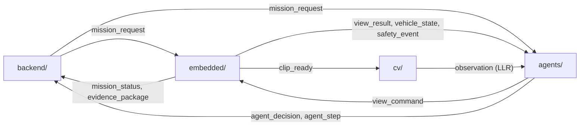

# UAV xác minh cảnh báo cháy rừng — Wildfire Active Smoke Verifier

Một UAV nhận toạ độ nghi cháy, **tự quyết định nhìn từ đâu, nhìn bao nhiêu lần và kết luận gì** về sự hiện diện của khói, rồi gửi bằng chứng về máy chủ để **con người** quyết định điều động.

**Giai đoạn hiện tại: MVP.** Mốc tối thiểu là **tính tác tử trên UAV**. Phần cứng: Pixhawk 2.4.8, camera RGB (không camera nhiệt), máy tính đồng hành RPi 5 hoặc Jetson Orin Nano.

## Bắt đầu từ đâu

| Bạn là | Đọc |
|---|---|
| Mọi người | [Kiến trúc tổng thể](docs/03-architecture/00-overview.md) §1–8, 13–14 → [Hợp đồng giao tiếp](docs/03-architecture/50-interfaces.md) → [CONTRIBUTING](CONTRIBUTING.md) |
| Sản phẩm / quản lý | [PRD](docs/01-PRD.md) |
| Nghiên cứu / viết paper | [RRD](docs/02-RRD.md) |
| Owner một module | README trong thư mục module + tài liệu module trong `docs/03-architecture/` |

## Cấu trúc repo — 4 module độc lập

```
UAV-agents/
├── docs/                 # Trưởng nhóm — PRD, RRD, kiến trúc, hợp đồng giao tiếp (nguồn sự thật)
│   ├── 01-PRD.md
│   ├── 02-RRD.md
│   ├── 03-architecture/  # 00-overview, 10-agents, 20-cv, 30-embedded, 40-backend, 50-interfaces, 60-hardware, 90-decisions
│   ├── interfaces/       # JSON Schema + ví dụ + validate.py (CI)
│   ├── research/         # báo cáo rà soát, ghi chú nghiên cứu
│   └── archive/          # bản đặc tả v2
├── agents/               # AGT — tác tử onboard: niềm tin, chọn góc nhìn, dừng/kết luận, mô phỏng L0
├── cv/                   # CV  — clip → LLR đã hiệu chỉnh; dữ liệu, huấn luyện, artifact observation_model
├── embedded/             # EMB — Pixhawk/ArduPilot, bay an toàn, gimbal/camera, nền tảng onboard, SITL/HITL
└── backend/              # BE  — cảnh báo, prior b₀, phê duyệt, dashboard, bằng chứng, phân xử vận hành
```



**Quy tắc vàng:** các module **không import code của nhau**. Chỉ giao tiếp qua thông điệp MQTT theo schema trong [`docs/interfaces/`](docs/interfaces/) và qua artifact có phiên bản. Phương pháp và ngưỡng **không hardcode**: chọn bằng tên trong `*/configs/*.yaml`.

## Kiểm tra hợp đồng

```bash
pip install -r docs/interfaces/tools/requirements.txt
python docs/interfaces/tools/validate.py
```
