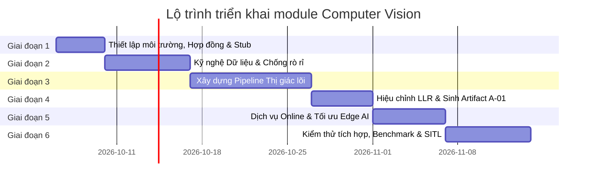

# KẾ HOẠCH HÀNH ĐỘNG CHI TIẾT — MODULE COMPUTER VISION (`cv/`)

**Dự án:** UAV xác minh cảnh báo cháy rừng (*Wildfire Active Smoke Verifier*)  
**Module:** `cv/` (Thị giác máy tính)  
**Chủ sở hữu (Owner):** Nguyễn Văn Đạt  
**Tài liệu căn cứ:** [PRD (01-PRD.md)](../docs/01-PRD.md) · [RRD (02-RRD.md)](../docs/02-RRD.md) · [Kiến trúc CV (20-cv.md)](../docs/03-architecture/20-cv.md) · [Hợp đồng giao tiếp (50-interfaces.md)](../docs/03-architecture/50-interfaces.md)  
**Phiên bản:** v1.0 — Ngày lập: 06/10/2026  

---

## 1. MỤC TIÊU VÀ ĐỊNH NGHĨA HOÀN THÀNH (DEFINITION OF DONE)

### 1.1 Mục tiêu tổng quát
Chuyển hóa **một clip hover-and-stare (1–4 giây, chỉ RGB)** thành **một quan sát xác suất đã hiệu chỉnh**:
$$\text{LLR} = \ln \frac{p(z \mid \text{SMOKE}, c)}{p(z \mid \text{NO\_SMOKE}, c)}$$
cùng cờ chất lượng (`valid`), danh sách lý do lỗi (`invalid_reasons`), và ngữ cảnh góc nhìn ($c$). Đồng thời, sinh artifact ngoại tuyến **A-01 `observation_model.json`** phục vụ bộ lập kế hoạch của Agent.

### 1.2 Tiêu chí hoàn thành MVP (DoD)
- [ ] Dịch vụ `perception_service` chạy ổn định trên MQTT, nhận `clip_ready` (I-06) $\rightarrow$ trả `observation` (I-07) hợp lệ theo JSON Schema trong $\le 5\text{ s}$ onboard (hoặc $\le 15\text{ s}$ mặt đất).
- [ ] Unit test toán học chứng minh $\text{LLR} = \operatorname{logit}(q) - \operatorname{logit}(\pi_{\text{cal}})$ bất biến với tỷ lệ mẫu dương $\pi_{\text{cal}}$ của tập hiệu chỉnh.
- [ ] 100% các mã lỗi chất lượng (`BLUR`, `OVEREXPOSED`, `UNDEREXPOSED`, `SUN_GLARE`, `TARGET_OUT_OF_FOV`) có clip kiểm thử chuyên biệt.
- [ ] Xuất bản Artifact **A-01 `observation_model.json` v0.1** có phiên bản cùng Model Card đầy đủ số liệu đánh giá (in-domain, cross-dataset zero-shot, FPR theo từng loại giả khói).
- [ ] Tái lập và benchmark baseline **VMOKED** bằng bộ đánh giá chuẩn có mẫu âm của dự án.
- [x] Cung cấp công cụ giả lập **`fake_perception`** cho các module khác (`agents/`, `embedded/`, `backend/`) kiểm thử tích hợp.

---

## 2. KẾ HOẠCH TRIỂN KHAI THEO 6 GIAI ĐOẠN

---

### GIAI ĐOẠN 1: Thiết lập môi trường, Hợp đồng & Stubbing
> **Mục tiêu:** Mở khóa tiến độ cho toàn bộ nhóm (Mốc M0 & M1). Cung cấp `fake_perception` để AGT, EMB, BE có thể chạy thử ngay mà không phải chờ CV code xong model.

#### Công việc cụ thể:
1. **Khởi tạo môi trường phát triển:**
   - Cài đặt Python 3.10+, tạo môi trường ảo `venv`.
   - Cài đặt thư viện cốt lõi: `paho-mqtt`, `jsonschema`, `opencv-python`, `pytest`, `pyyaml`.
2. **Tạo cấu trúc khung module `cv/src/uav_cv/`:**
   - Dựng cây thư mục: `service/`, `quality/`, `stabilize/`, `detect/`, `track/`, `motion/`, `classify/`, `calibrate/`.
   - Cài đặt `registry.py` để nạp các thuật toán qua tên config (ADR-004).
3. **Phát triển Stub `fake_perception` ([`cv/tests/fake_perception.py`](tests/fake_perception.py)):**
   - Lắng nghe topic `uav/{uav_id}/embedded/clip_ready`.
   - Giả lập độ trễ tính toán (1.5s).
   - Phát thông điệp `uav/{uav_id}/cv/observation` hợp lệ theo kịch bản:
     - Kịch bản khói thật ($H_1$): LLR ngẫu nhiên $[+1.5, +3.5]$.
     - Kịch bản không khói ($H_0$): LLR ngẫu nhiên $[-3.0, -1.0]$.
     - Kịch bản clip lỗi: `valid = false`, `llr = null`, `invalid_reasons = ["SUN_GLARE"]`.
4. **Kiểm tra hợp đồng Schema tự động:**
   - Viết test kiểm tra tính hợp lệ của `fake_perception` với [`docs/interfaces/schemas/observation.schema.json`](../docs/interfaces/schemas/observation.schema.json).

* **Công cụ cần dùng:** Python, VS Code, Mosquitto MQTT broker, `validate.py`.
* **Lưu ý quan trọng:**
  > Stub phải phát thông điệp khớp hoàn toàn từng kiểu dữ liệu trong Schema (đặc biệt các trường bắt buộc như `header`, `view_id`, `clip_id`, `valid`, `llr`, `context`, `provenance`).

---

### GIAI ĐOẠN 2: Kỹ nghệ Dữ liệu & Xử lý rò rỉ (Data Engineering)
> **Mục tiêu:** Xây dựng tập dữ liệu sạch, không bị rò rỉ (leakage), có đầy đủ mẫu âm tính khó.

#### Công việc cụ thể:
1. **Thu thập dữ liệu từ các kho công khai:**
   - Tải về và cấu trúc hóa: *Boreal Forest Fire (UAV)*, *FLAME 3 (chỉ lấy RGB)*, *FASDD (UAV subset)*, *D-Fire*.
   - Khai báo đầy đủ vào [`cv/data/README.md`](data/README.md). Tuyệt đối **không commit file ảnh/video vào Git**.
2. **Viết công cụ Khử trùng lặp gần (Near-deduplication) ([`cv/training/deduplicate.py`](training/deduplicate.py)):**
   - Quét toàn bộ khung hình bằng pHash (Perceptual Hashing) và khoảng cách Hamming.
   - Loại bỏ các frame gần trùng lặp giữa các video khác nhau (bài học: FASDD bị trùng lặp tới 90.7% giữa train và test).
3. **Viết script chia tập theo nhóm ([`cv/training/split_groups.py`](training/split_groups.py)):**
   - Chia thành 3 tập: `Train (60%)`, `Calibration (20%)`, `Test (20%)`.
   - **Quy tắc bắt buộc:** Chia theo **Sự kiện / Video / Địa điểm**, cấm chia ngẫu nhiên theo từng frame.
4. **Chuẩn bị tập mẫu âm tính khó (Hard Negatives):**
   - Thu thập và gán nhãn các clip sương mù sáng sớm, mây bay thấp che sườn đồi, bụi xe chạy đường đất, hơi nước sau mưa.
5. **Khai phá dữ liệu đa góc (Multi-view):**
   - Trích xuất thông tin góc nhìn (cự ly, góc mặt trời tương đối) từ metadata của các clip UAV.

* **Công cụ cần dùng:** `imagehash`, `scikit-learn`, `ffmpeg`, `pandas`, ổ cứng lưu trữ ngoài hoặc Google Drive / NAS trường.
* **Lưu ý quan trọng:**
  > Mẫu âm tính bắt buộc phải có nhãn loại giả khói (`FOG`, `CLOUD`, `DUST`, `STEAM`) để sau này báo cáo FPR chi tiết cho từng loại.

---

### GIAI ĐOẠN 3: Xây dựng Pipeline Thị giác lõi (Vision Pipeline)
> **Mục tiêu:** Xây dựng trọn vẹn chuỗi xử lý clip thành vector đặc trưng chuyển động vật lý và phân loại.

#### Công việc cụ thể:
1. **Module Cổng chất lượng ảnh ([`cv/src/uav_cv/quality/heuristic_gate.py`](src/uav_cv/quality/heuristic_gate.py)):**
   - Tính phương sai Laplacian (Laplacian variance) $\rightarrow$ nếu $< 60.0 \rightarrow$ gán `BLUR`.
   - Tính tỷ lệ điểm ảnh cháy sáng/tối qua Histogram $\rightarrow$ gán `OVEREXPOSED` / `UNDEREXPOSED`.
   - Tính góc lệch mặt trời: $|\text{camera\_yaw} - \text{sun\_azimuth}| \rightarrow$ nếu $< 20^\circ \rightarrow$ kiểm tra độ lóa nắng `SUN_GLARE`.
   - Chiếu điểm 3D mục tiêu vào ma trận nội suy camera $\rightarrow$ nếu lệch khung hình $\rightarrow$ gán `TARGET_OUT_OF_FOV`.
2. **Module Ổn định hình ảnh ([`cv/src/uav_cv/stabilize/ecc_affine.py`](src/uav_cv/stabilize/ecc_affine.py)):**
   - Dùng OpenCV `findTransformECC` với mô hình biến đổi Affine/Euclidean giữa các frame kế tiếp.
   - Bù trừ chuyển động trôi dạt của UAV để nền rừng cố định tuyệt đối.
3. **Module Bộ dò vùng khói ứng viên ([`cv/src/uav_cv/detect/yolo_detector.py`](src/uav_cv/detect/yolo_detector.py)):**
   - Fine-tune **YOLO11n** (kích thước 640, lấy mẫu $k=12$ frames/clip).
   - Đặt ngưỡng tin cậy thấp (`min_score = 0.15`) để không bỏ sót vùng nghi vấn.
4. **Module Bám vết đám khói ([`cv/src/uav_cv/track/iou_tracker.py`](src/uav_cv/track/iou_tracker.py)):**
   - Liên kết các bounding box giữa 12 frames thành các quỹ đạo (tracks) dựa trên chỉ số IoU.
5. **Module Đặc trưng chuyển động vật lý ([`cv/src/uav_cv/motion/dis_flow.py`](src/uav_cv/motion/dis_flow.py)):**
   - Chạy DIS Optical Flow (`cv2.optflow.createOptFlow_DIS`) trên các frame đã được ổn định.
   - Trích xuất 4 chỉ số vật lý then chốt:
     1. $v_{\text{vertical}}$: Vận tốc bốc lên theo phương thẳng đứng.
     2. $\text{div}$: Độ nở rộng của dòng chảy ($\nabla \cdot \vec{v} > 0$).
     3. $\text{coherence}$: Độ đồng hướng của luồng khí.
     4. $\text{source\_score}$: Điểm hội tụ của các vector vận tốc ngược về gốc phát nguồn.
6. **Module Phân loại clip ([`cv/src/uav_cv/classify/gbdt_classifier.py`](src/uav_cv/classify/gbdt_classifier.py)):**
   - Gom vector đặc trưng: [4 chỉ số flow + diện tích bbox + độ tin cậy detector + độ tương phản].
   - Huấn luyện mô hình **LightGBM/XGBoost** để đưa ra điểm số xác suất thô $q_{\text{raw}}$.

* **Công cụ cần dùng:** `opencv-contrib-python`, `ultralytics`, `lightgbm`, `numpy`.
* **Lưu ý quan trọng:**
  > **Tuyệt đối không dùng phép trừ ảnh (Frame Differencing) kiểu VMOKED.** Phép trừ ảnh sẽ coi sương mù trôi dạt là khói và làm mất dấu phần ruột của các cột khói lớn.

---

### GIAI ĐOẠN 4: Hiệu chỉnh LLR & Sinh Artifact A-01 (Calibration & Artifact)
> **Mục tiêu:** Biến điểm số phân loại thành giá trị LLR chuẩn tắc khoa học và xuất file cấu hình cho Agent.

#### Công việc cụ thể:
1. **Module Hiệu chỉnh xác suất ([`cv/src/uav_cv/calibrate/isotonic_binned.py`](src/uav_cv/calibrate/isotonic_binned.py)):**
   - Chia tập dữ liệu hiệu chỉnh thành các bin theo cự ly ($100\text{m}, 150\text{m}, 200\text{m}$) và góc mặt trời ($<45^\circ, 45\text{--}135^\circ, >135^\circ$).
   - Fit mô hình Isotonic Regression trên từng bin để thu được xác suất hậu nghiệm đã hiệu chỉnh $q$.
2. **Tính toán Log-Likelihood Ratio chuẩn:**
   - Thực hiện công thức triệt tiêu prior:
     $$\text{LLR} = \operatorname{logit}(q) - \operatorname{logit}(\pi_{\text{cal}})$$
   - Kẹp ngưỡng an toàn: $\text{LLR} = \max(-6.0, \min(6.0, \text{LLR}))$.
3. **Ước lượng tương quan giữa các góc nhìn $\tau$:**
   - Tính hệ số tương quan $\rho$ giữa các góc nhìn của cùng một đám khói.
   - Tính hệ số làm mềm niềm tin: $\tau = \frac{1}{1 + (\bar{n} - 1)\bar{\rho}}$ (ví dụ $\tau \approx 0.6$).
4. **Sinh file Artifact A-01 ([`cv/training/generate_artifact.py`](training/generate_artifact.py)):**
   - Tạo file JSON theo đúng [observation_model.schema.json](../docs/interfaces/schemas/observation_model.schema.json).
   - Lưu trữ tại đường dẫn có phiên bản: `artifacts/observation_model/0.1.0/observation_model.json`.
5. **Viết Model Card (`artifacts/cv-bundle/0.1.0/MODEL_CARD.md`):**
   - Ghi lại cấu hình huấn luyện, git commit, ECE (Expected Calibration Error), ma trận nhầm lẫn và FPR cho từng loại giả khói.

* **Công cụ cần dùng:** `scikit-learn` (`IsotonicRegression`), `scipy`, `matplotlib`.
* **Lưu ý quan trọng:**
  > Quên trừ đi $\operatorname{logit}(\pi_{\text{cal}})$ là lỗi sai nghiêm trọng nhất trong tích hợp, vì nó sẽ khiến Agent đếm tiên nghiệm 2 lần!

---

### GIAI ĐOẠN 5: Dịch vụ Online `perception_service` & Tối ưu Edge AI
> **Mục tiêu:** Đóng gói thành dịch vụ MQTT hoàn chỉnh, sẵn sàng chạy trên Raspberry Pi 5 hoặc Jetson Orin Nano.

#### Công việc cụ thể:
1. **Xây dựng Online Service daemon ([`cv/src/uav_cv/service/main.py`](src/uav_cv/service/main.py)):**
   - Lắng nghe MQTT topic: `uav/{uav_id}/embedded/clip_ready`.
   - Phân tích URI: hỗ trợ `file:///...` (chạy onboard) và `https://...` (chạy máy chủ mặt đất).
   - Kiểm tra mã băm SHA-256 của video clip để đảm bảo dữ liệu không bị hỏng khi truyền nhận.
   - Đưa video qua pipeline (Quality Gate $\rightarrow$ Stabilize $\rightarrow$ Detect $\rightarrow$ Track $\rightarrow$ Flow $\rightarrow$ Classify $\rightarrow$ Calibrate).
   - Phát kết quả lên `uav/{uav_id}/cv/observation` (QoS 1).
2. **Tối ưu hóa Edge AI (Model Export):**
   - Xuất mô hình sang ONNX format.
   - Biên dịch sang **NCNN** cho CPU Raspberry Pi 5 (profile `mvp_rpi5`).
   - Biên dịch sang **TensorRT FP16** cho Jetson Orin Nano (profile `mvp_jetson`).
3. **Đo kiểm ngân sách thời gian:**
   - Đo thời gian xử lý: Đảm bảo toàn bộ pipeline chạy $\le 5.0\text{ s}$ trên bo nhúng và $\le 15.0\text{ s}$ trên máy tính mặt đất (NFR-07).
4. **Đóng gói dịch vụ:**
   - Viết file `systemd` service và script khởi động `run_service.sh` theo hướng dẫn của module Embedded.

* **Công cụ cần dùng:** `paho-mqtt`, `onnx`, `ncnn`, `tensorrt` (nếu dùng Jetson), `requests`.
* **Lưu ý quan trọng:**
  > Không module nào được giả định CV chạy ở đâu. Chỉ cần sửa `io.clip_fetch` và `runtime.backend` trong file config là service phải tự thích ứng.

---

### GIAI ĐOẠN 6: Kiểm thử toàn diện, Benchmark VMOKED & Tích hợp SITL
> **Mục tiêu:** Nghiệm thu chất lượng, hoàn thiện các test case và tham gia bay mô phỏng liên module (Mốc M2 & M3).

#### Công việc cụ thể:
1. **Bộ kiểm thử Contract Schema ([`cv/tests/test_contract.py`](tests/test_contract.py)):**
   - Kiểm tra mọi thông điệp `observation` sinh ra phải pass qua JSON Schema validator.
2. **Bộ kiểm thử toán học LLR ([`cv/tests/test_llr_math.py`](tests/test_llr_math.py)):**
   - Thay đổi nhân tạo tỷ lệ nhãn dương trong tập kiểm tra, chứng minh output LLR không bị trôi dạt.
3. **Bộ kiểm thử ngoại lệ chất lượng ([`cv/tests/test_quality_gate.py`](tests/test_quality_gate.py)):**
   - Đưa clip rung mờ, clip ngược nắng, clip tối đen $\rightarrow$ Xác nhận hệ thống trả về `valid = false`, `llr = null` và đúng mã enum lỗi.
4. **Tái lập và so sánh với Baseline VMOKED ([`cv/training/eval_vmoked_baseline.py`](training/eval_vmoked_baseline.py)):**
   - Đánh giá mã nguồn VSMOKED trên cùng tập test có mẫu âm để chỉ ra các điểm yếu của phương pháp cũ (làm số liệu cho báo cáo NCKH / Paper).
5. **Tham gia mô phỏng liên hoàn L1 (SITL):**
   - Chạy `perception_service` song song với `mission_executor` (Embedded) và `agent_runtime` (Agents) trong môi trường ArduPilot SITL. Đảm bảo chạy trôi chảy $\ge 10$ nhiệm vụ liên tiếp.

---

## 3. BẢNG DANH MỤC CÔNG CỤ & THƯ VIỆN CẦN THIẾT

| Hạng mục | Công nghệ / Thư viện | Mục đích sử dụng | Ghi chú |
|---|---|---|---|
| **Ngôn ngữ** | Python 3.10 / 3.11 | Ngôn ngữ phát triển chính | Thống nhất toàn dự án |
| **Giao tiếp Bus** | `paho-mqtt` | Lắng nghe & phát thông điệp MQTT | Kết nối Mosquitto broker |
| **Kiểm tra Schema** | `jsonschema` (Draft 2020-12) | Validate thông điệp I-06, I-07 | Nguồn chân lý kiến trúc |
| **Xử lý ảnh/video** | `opencv-contrib-python` | Đọc video, ECC stabilize, DIS flow | Bắt buộc bản contrib có DIS flow |
| **Khử trùng lặp** | `imagehash` | Tính pHash loại bỏ khung hình trùng | Tránh rò rỉ tập dữ liệu |
| **Bộ dò đối tượng** | `ultralytics` / `RT-DETR` / `D-FINE` | Phát hiện bounding box khói | Dùng YOLO11n cho prototype |
| **Bộ phân loại** | `lightgbm` / `xgboost` / `scikit-learn` | Phân loại clip dựa trên vector đặc trưng | Nhẹ, chạy tốt trên CPU |
| **Hiệu chỉnh LLR** | `scikit-learn` (`IsotonicRegression`) | Fit xác suất & trừ logit tỷ lệ dương | Tạo LLR cho Agent |
| **Biên dịch Edge** | `onnx`, `ncnn` / `tensorrt` | Tối ưu suy luận trên RPi 5 / Jetson | Đảm bảo thời gian $\le 5$s |
| **Kiểm thử** | `pytest`, `pytest-cov` | Chạy bộ test unit và integration | Chạy tự động trong CI |

---

## 4. BẢNG QUẢN TRỊ RỦI RO & PHƯƠNG ÁN GIẢM THIỂU

| STT | Rủi ro tiềm ẩn | Mức độ | Phương án xử lý của role CV |
|:---:|---|:---:|---|
| **1** | **Thiếu dữ liệu UAV đa góc ở Việt Nam** | Cao | Bắt đầu ngay với các tập quốc tế (Boreal, FLAME 3); đề xuất đội Embedded dùng flycam thương mại nhỏ (DJI Mini) thu thập sớm các kịch bản đốt thực bì có kiểm soát. |
| **2** | **RPi 5 chạy quá 5 giây/clip** | Trung bình | Giảm số khung lấy mẫu từ 12 xuống 8 frames/clip; giảm độ phân giải đầu vào detector xuống 416 hoặc 320; dùng NCNN INT8. |
| **3** | **Bị lóa nắng buổi trưa làm nhận nhầm khói** | Trung bình | Tận dụng trường `sun_rel_azimuth_deg` trong metadata: Nếu camera nhìn thẳng vào hướng mặt trời $\pm 20^\circ$, kích hoạt cổng chất lượng đánh dấu `SUN_GLARE` và gán `valid = false`. |
| **4** | **Vấn đề bản quyền mô hình (AGPL)** | Thấp | YOLO11 dính giấy phép AGPL-3.0. Dùng YOLO11n cho giai đoạn thử nghiệm; trước khi đóng gói sản phẩm sẽ chuyển sang D-FINE-S hoặc RT-DETRv2-S (giấy phép Apache-2.0). |

---

## 5. HÀNH ĐỘNG NGAY HÔM NAY (CHECKLIST TUẦN 1)

- [x] Tạo môi trường ảo Python và cài đặt `paho-mqtt`, `jsonschema`, `opencv-contrib-python`.
- [x] Hoàn thành script **`cv/tests/fake_perception.py`** để bàn giao cho các thành viên AGT, EMB, BE test giao tiếp.
- [ ] Tải bộ dữ liệu **Boreal Forest Fire** và **FLAME 3** về ổ cứng cá nhân (không đưa vào git).
- [ ] Viết script `deduplicate.py` khử trùng lặp và script `split_groups.py` chia tập theo video.
- [ ] Chạy thử OpenCV DIS Flow trên 1 đoạn video mẫu để đo thời gian xử lý trên máy tính cá nhân.
