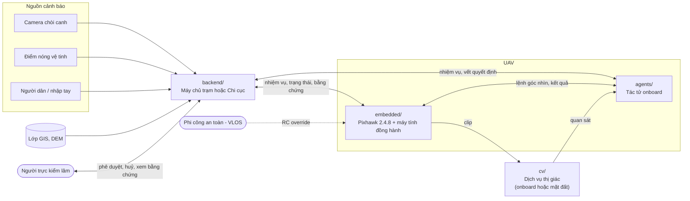
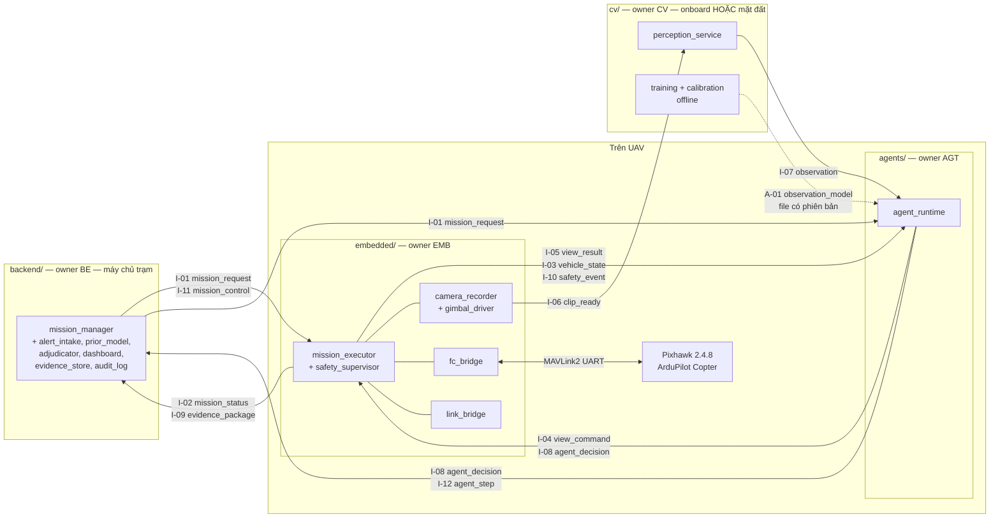
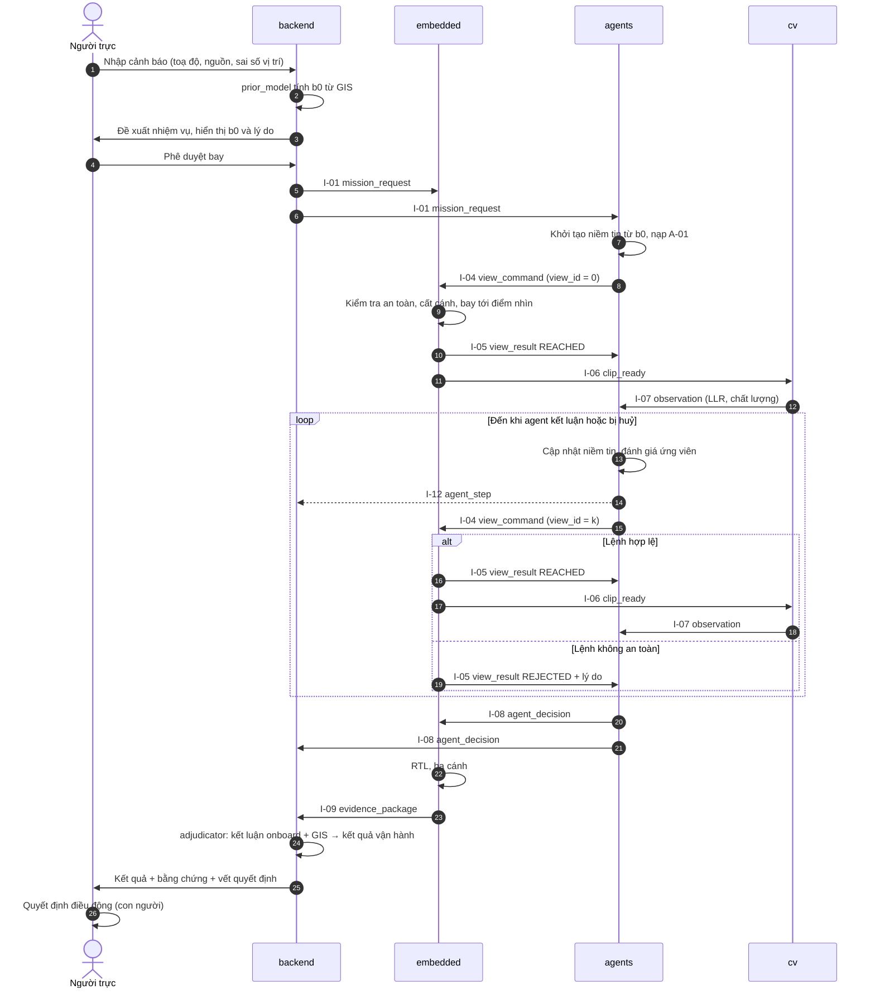
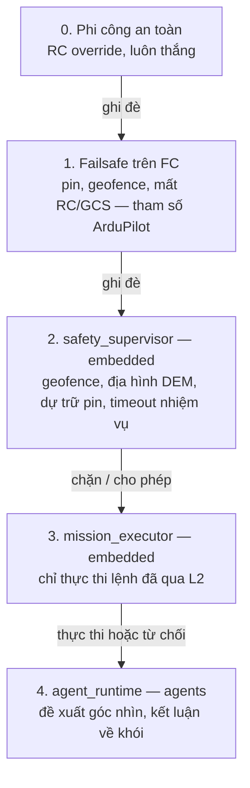
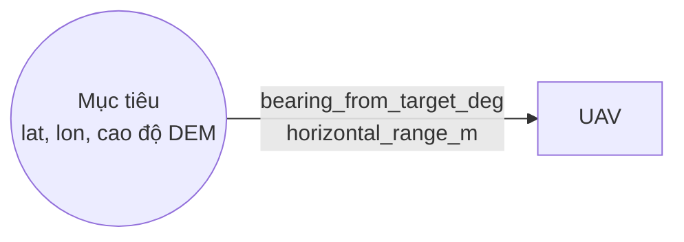
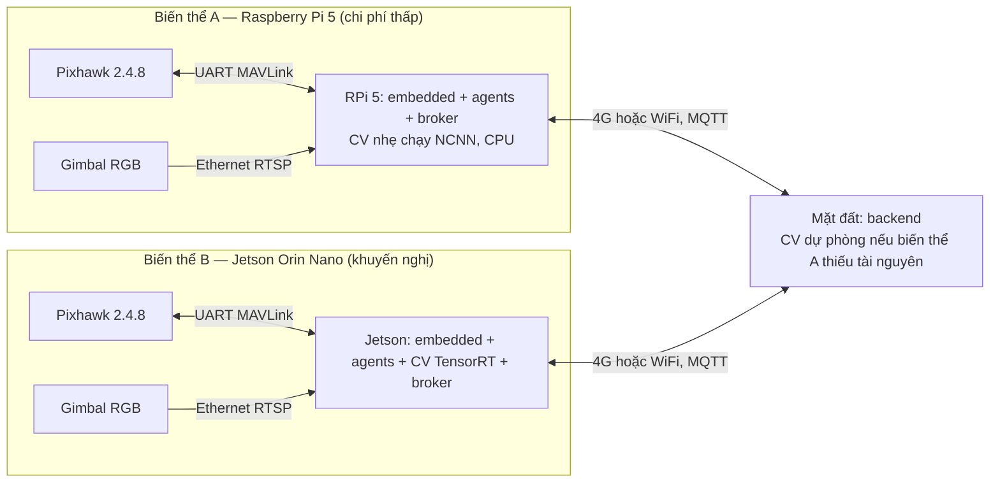
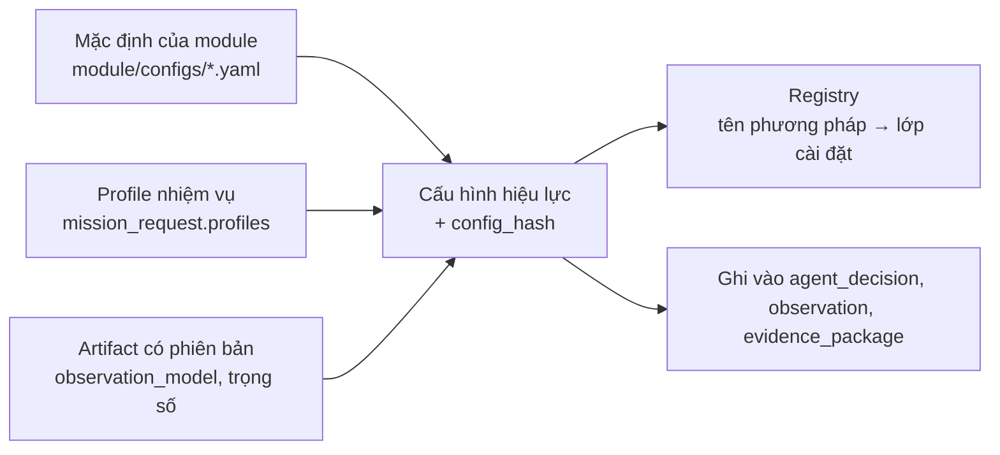

# Kiến trúc tổng thể — UAV xác minh cảnh báo cháy rừng (v3)

| | |
|---|---|
| Phiên bản | v3.0 — 02/10/2026 |
| Trạng thái | **Bản sơ bộ cho MVP**. Hợp đồng giao tiếp ở mức `0.1.x` |
| Chủ sở hữu | Trưởng nhóm kiến trúc (chủ nhiệm đề tài) |
| Quy tắc thay đổi | Sửa tài liệu này và `docs/interfaces/` phải qua PR, có duyệt của **tất cả** owner bị ảnh hưởng (xem [CONTRIBUTING](../../CONTRIBUTING.md)) |
| Tài liệu liên quan | [PRD](../01-PRD.md) · [RRD](../02-RRD.md) · [Hợp đồng giao tiếp](50-interfaces.md) · [Phần cứng](60-hardware.md) · [Quyết định kiến trúc](90-decisions.md) |

> **Đọc mục 1–8 trước khi viết dòng code đầu tiên.** Phần lớn lỗi tích hợp trong dự án nhiều người đến từ hiểu khác nhau về *ai làm gì* và *dữ liệu nghĩa là gì*, không đến từ thuật toán. Tài liệu này tồn tại để chặn những lỗi đó.

---

## 0. Ai đọc gì

| Vai trò | Bắt buộc đọc | Đọc khi cần |
|---|---|---|
| **Mọi người** | Tài liệu này (mục 1–8, 13–14), [50-interfaces](50-interfaces.md) | [PRD](../01-PRD.md) |
| Owner `agents/` (AGT) | [10-agents](10-agents.md) | [RRD](../02-RRD.md) §2–5, [20-cv](20-cv.md) §5 (định nghĩa LLR) |
| Owner `cv/` (CV) | [20-cv](20-cv.md) | [RRD](../02-RRD.md) §6–7 (dữ liệu), [10-agents](10-agents.md) §4 (agent dùng quan sát thế nào) |
| Owner `embedded/` (EMB) | [30-embedded](30-embedded.md), [60-hardware](60-hardware.md) | [90-decisions](90-decisions.md) ADR-001, ADR-008 |
| Owner `backend/` (BE) | [40-backend](40-backend.md) | [PRD](../01-PRD.md) §6–7 |

---

## 1. Bài toán, phát biểu chính xác

**Bài toán của cả hệ thống (MVP):**

> Một UAV nhận một toạ độ nghi cháy, **tự quyết định nhìn từ đâu, nhìn bao nhiêu lần, và kết luận gì về sự hiện diện của khói** (có khói / không có khói / không kết luận được), trong giới hạn an toàn do tầng nhúng cưỡng chế. Mọi kết luận được gửi về máy chủ kèm bằng chứng để **con người** quyết định điều động.

Bài toán này được tách thành **4 bài toán thành phần độc lập**. Mỗi bài toán có đầu vào, đầu ra và một câu "**không phải việc của tôi**" rõ ràng:

| Mã | Bài toán thành phần | Đầu vào | Đầu ra | **Không phải việc của module này** |
|---|---|---|---|---|
| **P-EMB** | Đưa camera tới **đúng góc nhìn được yêu cầu một cách an toàn**, rồi quay một **clip ổn định có đủ siêu dữ liệu** | `view_command`, `mission_request`, `mission_control` | `view_result`, `clip_ready`, `vehicle_state`, `safety_event`, `mission_status`, `evidence_package` | Không biết có khói hay không. Không chọn góc nhìn |
| **P-CV** | Biến **một clip** thành **một quan sát đã hiệu chỉnh**: LLR về khói + cờ chất lượng + ngữ cảnh | `clip_ready` | `observation` (online), `observation_model` (artifact offline) | Không quyết định bay đâu. Không kết luận nhiệm vụ. Không cộng prior |
| **P-AGT** | Từ chuỗi quan sát, **duy trì niềm tin** và **chọn hành động tiếp theo** (góc nhìn kế tiếp hoặc kết luận) theo chi phí và ràng buộc rủi ro | `mission_request`, `observation`, `view_result`, `vehicle_state`, `safety_event`, artifact `observation_model` | `view_command`, `agent_step`, `agent_decision` | Không xử lý pixel. Không nói MAVLink. Không vượt quyền an toàn |
| **P-BE** | Tiếp nhận cảnh báo, **khởi tạo prior b₀**, cho người phê duyệt, giám sát, lưu bằng chứng, **diễn giải kết luận onboard thành kết quả vận hành** | Cảnh báo, GIS, `mission_status`, `agent_step`, `agent_decision`, `evidence_package` | `mission_request`, `mission_control`, kết quả vận hành, thông báo | Không điều khiển bay. Không chạy mô hình thị giác trong vòng quyết định |

**Mốc MVP tối thiểu = tính tác tử trên UAV**: vòng lặp *quan sát → cập nhật niềm tin → chọn góc kế tiếp hoặc kết luận* chạy trên máy tính đồng hành của UAV, có số lần quan sát **thay đổi theo tình huống**, và kết thúc bằng một trong ba kết luận kèm giải trình.

---

## 2. Nguyên tắc kiến trúc (bắt buộc)

| # | Nguyên tắc | Hệ quả cụ thể |
|---|---|---|
| **P1** | **Hợp đồng trước, code sau** | `docs/interfaces/schemas/*.schema.json` là nguồn sự thật duy nhất về thông điệp. Code phải validate theo schema trong test |
| **P2** | **Không import chéo module** | `agents/` không import gì từ `cv/`, `embedded/`, `backend/` và ngược lại. Chỉ giao tiếp qua thông điệp (MQTT) và artifact có phiên bản |
| **P3** | **Không hardcode phương pháp và ngưỡng** | Phương pháp chọn bằng **tên trong config** qua registry. Mọi hằng số nằm trong config hoặc artifact, kèm nguồn gốc (xem §10). Code không chứa "số ma thuật" |
| **P4** | **Thẩm quyền an toàn thuộc tầng nhúng** | Agent chỉ **đề xuất**. Embedded **kiểm tra rồi thực thi hoặc từ chối có lý do**. Không ai ngoài phi công và failsafe ghi đè được an toàn (xem §7) |
| **P5** | **Tách giả thuyết** | Onboard chỉ kết luận về **khói** (H₁ = có khói, H₀ = không khói). Ý nghĩa vận hành (cháy rừng / khói trên đất canh tác / báo giả) do backend diễn giải ([ADR-002](90-decisions.md)) |
| **P6** | **CV xuất LLR đã hiệu chỉnh, không xuất posterior** | Prior chỉ có **một** nguồn: `mission_request.prior.b0` từ backend. Không ai được cộng prior lần hai ([ADR-007](90-decisions.md)) |
| **P7** | **Mọi thứ ghi lại và phát lại được** | Mọi thông điệp được log. Agent cho cùng kết quả khi phát lại cùng log + cùng config + cùng seed |
| **P8** | **Vị trí chạy CV cấu hình được** | CV có thể chạy trên UAV hoặc ở mặt đất ([ADR-005](90-decisions.md)). Không module nào giả định CV chạy ở đâu |
| **P9** | **Một quy ước chung** | Đơn vị SI, góc theo độ, thời gian UTC, hệ quy chiếu theo §8 |

---

## 3. Sơ đồ ngữ cảnh hệ thống

---

## 4. Sơ đồ thành phần và hợp đồng giao tiếp

Mỗi mũi tên là **một hợp đồng có mã** (`I-xx` cho thông điệp, `A-xx` cho artifact). Chi tiết trường dữ liệu nằm trong [50-interfaces](50-interfaces.md) và `docs/interfaces/schemas/`.

### 4.1 Danh mục hợp đồng

| Mã | Tên | Bên phát → Bên nhận | Khi nào | Schema |
|---|---|---|---|---|
| I-01 | `mission_request` | BE → EMB, AGT | Sau khi người trực phê duyệt | [mission_request](../interfaces/schemas/mission_request.schema.json) |
| I-02 | `mission_status` | EMB → BE | 1 Hz + khi đổi pha | [mission_status](../interfaces/schemas/mission_status.schema.json) |
| I-03 | `vehicle_state` | EMB → AGT (BE nhận bản thưa) | 1–5 Hz | [vehicle_state](../interfaces/schemas/vehicle_state.schema.json) |
| I-04 | `view_command` | AGT → EMB | Mỗi bước quyết định | [view_command](../interfaces/schemas/view_command.schema.json) |
| I-05 | `view_result` | EMB → AGT | Đến nơi / từ chối / huỷ / quá hạn | [view_result](../interfaces/schemas/view_result.schema.json) |
| I-06 | `clip_ready` | EMB → CV | Sau mỗi lần hover-and-stare | [clip_ready](../interfaces/schemas/clip_ready.schema.json) |
| I-07 | `observation` | CV → AGT (BE lưu) | Mỗi clip | [observation](../interfaces/schemas/observation.schema.json) |
| I-08 | `agent_decision` | AGT → EMB, BE | Một lần mỗi nhiệm vụ | [agent_decision](../interfaces/schemas/agent_decision.schema.json) |
| I-09 | `evidence_package` | EMB → BE | Sau khi hạ cánh (hoặc khi có liên kết) | [evidence_package](../interfaces/schemas/evidence_package.schema.json) |
| I-10 | `safety_event` | EMB → AGT, BE | Khi có sự kiện an toàn | [safety_event](../interfaces/schemas/safety_event.schema.json) |
| I-11 | `mission_control` | BE → EMB | Người trực huỷ nhiệm vụ | [mission_control](../interfaces/schemas/mission_control.schema.json) |
| I-12 | `agent_step` | AGT → BE | Mỗi bước quyết định (vết sống) | [agent_step](../interfaces/schemas/agent_step.schema.json) |
| A-01 | `observation_model` | CV → AGT (file, offline) | Mỗi lần CV hiệu chỉnh lại | [observation_model](../interfaces/schemas/observation_model.schema.json) |

---

## 5. Phân định trách nhiệm

| Module | Thư mục | Owner | Sở hữu | Chạy ở đâu | Yêu cầu PRD |
|---|---|---|---|---|---|
| Nhúng | `embedded/` | EMB | Tham số firmware FC, `fc_bridge`, `mission_executor`, `safety_supervisor`, `gimbal_driver`, `camera_recorder`, `link_bridge`, nền tảng máy tính đồng hành (OS, broker MQTT, dịch vụ hệ thống), SITL/HITL, đấu nối phần cứng | Máy tính đồng hành + FC | FR-EMB-xx |
| Tác tử | `agents/` | AGT | `agent_runtime` (niềm tin, sinh góc nhìn, planner, luật dừng, vết quyết định), bộ mô phỏng quan sát, benchmark chính sách | Máy tính đồng hành | FR-AGT-xx |
| Thị giác | `cv/` | CV | `perception_service`, pipeline dữ liệu (đăng ký nguồn, khử trùng lặp, chia tập), huấn luyện, hiệu chỉnh, xuất mô hình, artifact `observation_model` | Onboard hoặc mặt đất (cấu hình) | FR-CV-xx |
| Máy chủ | `backend/` | BE | `alert_intake`, `prior_model`, `mission_manager`, `adjudicator`, `dashboard`, `evidence_store`, `audit_log`, `notifier`, broker MQTT phía mặt đất | Máy chủ trạm / Chi cục | FR-BE-xx |
| Tài liệu và hợp đồng | `docs/` | Trưởng nhóm | PRD, RRD, kiến trúc, schema, công cụ kiểm tra schema | — | — |

**Đóng gói và triển khai:** EMB cung cấp **nền tảng chạy** trên máy tính đồng hành (OS, broker, giám sát dịch vụ). **Mỗi module tự đóng gói dịch vụ của mình** (venv hoặc container) theo quy ước trong [30-embedded §8](30-embedded.md). EMB không sửa code dịch vụ của module khác.

---

## 6. Luồng nhiệm vụ đầu-cuối

**Các nhánh ngoại lệ bắt buộc phải xử lý** (mỗi module có test riêng cho từng nhánh):

| Tình huống | Ai phát hiện | Hành vi bắt buộc |
|---|---|---|
| Pin chạm ngưỡng dự trữ | FC failsafe / `safety_supervisor` | EMB phát `safety_event` (ABORT) và RTL. AGT phát `agent_decision` = `UNDETERMINED`, lý do `SAFETY_ABORT` |
| Lệnh góc nhìn ngoài geofence / không đủ khoảng cách địa hình | `safety_supervisor` | EMB trả `view_result` = `REJECTED` + `reject_reason`. AGT loại góc đó và chọn lại; hết lựa chọn thì `UNDETERMINED` / `VIEW_INFEASIBLE` |
| CV không trả kết quả đúng hạn | AGT (timeout trong config) | AGT coi như **không có thông tin** (không cập nhật niềm tin), vẫn trừ ngân sách |
| Clip kém chất lượng | CV | `observation.valid = false`, `llr = null` + lý do. AGT không cập nhật niềm tin |
| Người trực huỷ | BE → `mission_control` | EMB RTL và phát `safety_event` (`MISSION_CANCELLED`). AGT kết thúc `UNDETERMINED` / `MISSION_CANCELLED` |
| Mất liên kết với mặt đất | EMB | Nhiệm vụ **tiếp tục** nếu CV chạy onboard. Nếu CV ở mặt đất thì AGT hết hạn chờ quan sát và kết thúc `UNDETERMINED`. FC failsafe theo tham số |
| Phi công chiếm quyền RC | FC | EMB phát `safety_event` (`PILOT_OVERRIDE`). Mọi lệnh tự động dừng ngay |

---

## 7. Thẩm quyền quyết định và an toàn

| Quyết định | Ai quyết | Chu kỳ | Ai có quyền ghi đè |
|---|---|---|---|
| Cân bằng, giữ vị trí, giữ hover | FC (ArduPilot) | 1–10 ms | Phi công |
| Huỷ nhiệm vụ do pin / mất liên kết / geofence | FC failsafe + `safety_supervisor` | Liên tục | Phi công |
| Lệnh góc nhìn có được thực thi không | `safety_supervisor` | Mỗi lệnh | — |
| Bay tới điểm nhìn đã duyệt | `mission_executor` + FC (Guided) | 10–100 ms | Failsafe, phi công |
| **Nhìn ở đâu tiếp theo** | **agent_runtime** | 0,02–0,2 Hz (một lần mỗi góc nhìn) | `safety_supervisor` có thể từ chối |
| **Nhìn tiếp hay dừng** | **agent_runtime** | Mỗi quan sát | Failsafe (buộc kết thúc) |
| **Kết luận về khói** | **agent_runtime** | Một lần mỗi nhiệm vụ | — |
| Diễn giải vận hành, xếp mức khẩn | `adjudicator` (backend) | Giây | Người trực |
| **Điều động lực lượng** | **Con người** | — | — |

---

## 8. Quy ước chung (ai sai mục này sẽ làm hỏng tích hợp)

### 8.1 Đơn vị, thời gian, định danh

| Đại lượng | Quy ước |
|---|---|
| Độ dài, độ cao | mét (`_m`) |
| Thời gian khoảng | giây (`_s`), mili-giây chỉ dùng cho độ trễ (`_ms`) |
| Mốc thời gian | **UTC**, RFC 3339 có mili-giây, ví dụ `2026-10-02T03:15:22.123Z`. **Cấm giờ địa phương** trong thông điệp |
| Góc | **độ** (`_deg`). Phương vị: 0° = Bắc thật, tăng theo chiều kim đồng hồ, miền [0, 360) |
| Xác suất | số thực trong (0, 1). Phần trăm chỉ dùng cho pin (`battery_pct`, 0–100) |
| Toạ độ | WGS84 `lat_deg`, `lon_deg` (độ thập phân, ≥ 7 chữ số sau dấu phẩy) |
| `mission_id` | `M-YYYYMMDD-NNN`, do backend cấp |
| `view_id` | Số nguyên ≥ 0, tăng dần trong một nhiệm vụ, do **agent** cấp |
| `clip_id` | `{mission_id}/v{view_id}`, do **embedded** cấp |
| `msg_id` | UUID v4 cho mọi thông điệp |

### 8.2 Hệ quy chiếu độ cao — nguồn lỗi nguy hiểm nhất

| Tên trường | Nghĩa | Ai dùng |
|---|---|---|
| `alt_amsl_m` | Độ cao so với mực nước biển trung bình (theo FC) | EMB nội bộ, `pose` |
| `height_agl_m` | Độ cao so với **mặt đất ngay dưới UAV** (từ DEM) | EMB, `vehicle_state` |
| `height_above_target_m` | Độ cao so với **mặt đất tại mục tiêu** (từ DEM) | **Chỉ dùng trong `view_spec`**, do AGT đặt |

> Agent **không bao giờ** gửi độ cao tuyệt đối hay toạ độ GPS. Agent gửi góc nhìn **tương đối mục tiêu** (`view_spec`). Embedded quy đổi sang toạ độ tuyệt đối bằng DEM và kiểm tra khoảng cách địa hình **dọc đường bay**.

### 8.3 Đặc tả góc nhìn `view_spec`

- `bearing_from_target_deg`: phương vị **của vị trí UAV nhìn từ mục tiêu**. Ví dụ 90° nghĩa là UAV đứng **phía Đông** mục tiêu và nhìn về phía Tây. Đây **không phải** hướng mũi camera.
- `horizontal_range_m`: khoảng cách ngang từ mục tiêu tới UAV.
- `height_above_target_m`: độ cao UAV so với mặt đất tại mục tiêu.
- `gimbal.mode = LOOK_AT_TARGET` (mặc định): embedded tự tính yaw và pitch để tâm ảnh hướng vào mục tiêu. `pitch_offset_deg` (dương = ngẩng lên) cho phép nhìn cao hơn để thấy cột khói. Camera pitch: 0° = nằm ngang, âm = chúc xuống.
- `hover_s`: thời gian hover-and-stare để quay clip.

### 8.4 Giả thuyết, niềm tin và LLR

| Ký hiệu | Định nghĩa |
|---|---|
| H₁ = `SMOKE` | Có khói **phát ra từ nguồn tại khu vực mục tiêu** |
| H₀ = `NO_SMOKE` | Không có khói như trên: sương, mây thấp, bụi, hơi nước, hoặc không có gì |
| b₀ | P(H₁) **trước** chuyến bay, do backend tính ([40-backend §5](40-backend.md)) |
| `llr` | ln p(z \| H₁, ngữ cảnh) − ln p(z \| H₀, ngữ cảnh), **logarit tự nhiên**, do CV tính trên **một clip** ([20-cv §5](20-cv.md)) |
| b_t | Niềm tin sau t quan sát, do **agent** tính bằng phương pháp fusion cấu hình ([10-agents §4](10-agents.md)) |

**Kết luận onboard** (`agent_decision.decision`): `SMOKE_CONFIRMED` · `NO_SMOKE` · `UNDETERMINED`.
**Kết quả vận hành** (backend, [40-backend §6](40-backend.md)): `FOREST_FIRE_URGENT` · `SMOKE_ON_CULTIVATED_LAND_REVIEW` · `FALSE_ALARM_NO_SMOKE` · `UNDETERMINED_HUMAN_REVIEW`.

---

## 9. Triển khai — hai biến thể phần cứng

Phần cứng **đã chốt**: Pixhawk 2.4.8, camera RGB, **không camera nhiệt**. Máy tính đồng hành **chưa chốt** ([60-hardware](60-hardware.md)). Kiến trúc hỗ trợ cả hai biến thể mà **không đổi code**, chỉ đổi config.

- **Agent luôn chạy trên UAV** (yêu cầu MVP). Agent rất nhẹ (vài MB RAM, mili-giây CPU mỗi bước).
- **CV**: chạy onboard nếu đủ tài nguyên. Nếu không, chạy ở mặt đất qua `clip_ready.uri` dạng `https://`. Đánh đổi: thêm vài giây tải clip mỗi góc nhìn, và phụ thuộc liên kết.
- Vòng quyết định có chu kỳ **hàng chục giây** (thời gian bay giữa các góc nhìn chiếm áp đảo), nên CV xử lý một clip trong ≤ 5 s onboard / ≤ 15 s mặt đất là đủ (NFR-07).

---

## 10. Cấu hình và nguyên tắc "không hardcode"

1. **Registry phương pháp.** Mỗi "khe" thuật toán (ví dụ `planner`, `stopping`, `detector`, `prior_model`) có **danh sách ứng viên** trong tài liệu module và được chọn bằng **tên** trong config. Thêm phương pháp mới chỉ là thêm một lớp, đăng ký tên, viết test. Không sửa luồng chính.
2. **Ba loại tham số**, không trộn lẫn:
   - *Tham số thiết kế* (lưới góc nhìn, ngân sách): config, có giá trị khởi điểm ghi rõ "cần kiểm chứng".
   - *Tham số ước lượng từ dữ liệu* (hiệu chỉnh LLR, τ tương quan, ngưỡng dừng hiệu chỉnh): **artifact**, kèm phiên bản dữ liệu và git SHA.
   - *Tham số rủi ro sản phẩm* (α báo nhầm, β bỏ sót): PRD → backend → `mission_request.risk_targets`.
3. **Truy vết.** Mỗi dịch vụ tính `config_hash` (SHA-256 của config hiệu lực đã chuẩn hoá) và ghi vào mọi thông điệp đầu ra có trường `provenance`.
4. **Giá trị dự phòng** (ví dụ τ = 1 khi chưa có artifact) được phép, nhưng **phải ghi cảnh báo vào vết quyết định**, không được im lặng.

---

## 11. Ghi log, truy vết, phát lại

- `link_bridge` ghi **mọi** thông điệp MQTT onboard ra file JSONL theo nhiệm vụ. Đây là đầu vào chuẩn cho phát lại.
- FC ghi dataflash log (`.BIN`). Clip lưu kèm `sha256`.
- `evidence_package` liệt kê đủ URI + checksum của: kết luận, vết quyết định, các quan sát, clip, log bay, log thông điệp, config hiệu lực.
- **Phát lại**: AGT cung cấp lệnh `replay <message_log.jsonl>` cho ra đúng chuỗi `agent_step`/`agent_decision` (NFR-04). CV cung cấp lệnh chạy lại `observation` từ clip. Đây là công cụ debug chính giữa các nhóm.

---

## 12. Mô phỏng và kiểm thử tích hợp

| Mức | Môi trường | Thành phần thật | Thành phần giả lập | Owner môi trường |
|---|---|---|---|---|
| **L0** | Bộ mô phỏng quan sát (Gymnasium) | `agent_runtime` | Toàn bộ thế giới: quan sát lấy mẫu từ A-01 + mô hình tương quan + mô hình chi phí bay | AGT |
| **L0-CV** | Benchmark offline | `perception_service`, mô hình | Clip có sẵn + nhãn | CV |
| **L1** | ArduPilot SITL + broker + `camera_recorder` phát lại clip thật theo góc | EMB, AGT, CV, BE (tất cả code thật) | Vật lý bay, camera (phát lại video) | EMB |
| **L2** | HITL trên bàn (tháo cánh quạt) | + Pixhawk 2.4.8, máy tính đồng hành, gimbal thật | Bay (SITL/HITL) | EMB |
| **L3** | Bay thật VLOS, nguồn khói kiểm soát | Tất cả | — | Cả nhóm |

Mỗi module **bắt buộc** cung cấp một **stub phát thông điệp hợp lệ theo schema** cho các module khác dùng khi kiểm thử độc lập. Ví dụ CV cung cấp `fake_perception` phát `observation` theo kịch bản. Stub nằm trong thư mục của module đó và chạy như một tiến trình độc lập, không import.

---

## 13. Mốc MVP và tiêu chí hoàn thành theo module

| Mốc | Mục tiêu | AGT | CV | EMB | BE | Tiêu chí xong |
|---|---|---|---|---|---|---|
| **M0 — Hợp đồng** | Schema v0.1 đông cứng | Xác nhận I-01/03/04/05/07/08/10/12, A-01 | Xác nhận I-06/07, A-01 | Xác nhận I-01..06/08..11 | Xác nhận I-01/02/08/09/11/12 | CI kiểm tra schema xanh; 4 owner duyệt PR |
| **M1 — Độc lập** | Mỗi module chạy một mình với stub | `agent_runtime` + L0; 3 baseline + chính sách MVP; vết quyết định | `perception_service` chạy offline trên clip có sẵn ra `observation` hợp lệ; `observation_model` v0 | SITL: nhận `view_command` → bay → hover → clip phát lại → `view_result` + `clip_ready` | Nhập cảnh báo → `mission_request`; hiển thị trạng thái/bằng chứng từ stub | Mỗi module có test hợp đồng xanh |
| **M2 — Tích hợp SITL (L1)** | Chạy đầu-cuối trong SITL | Chạy như dịch vụ trên broker | Chạy như dịch vụ | SITL + phát lại clip | Dashboard trực tiếp | ≥ 10 nhiệm vụ SITL liên tiếp không can thiệp, đủ 3 loại kết luận |
| **M3 — HITL (L2)** | Phần cứng thật trên bàn | Chạy trên máy tính đồng hành | Onboard hoặc mặt đất | Pixhawk 2.4.8 + máy tính đồng hành + gimbal | Qua 4G/WiFi | Đo được độ trễ; mọi nhánh ngoại lệ §6 kiểm thử đạt |
| **M4 — Bay thật VLOS (L3) = MVP** | Tính tác tử trên UAV thật | — | — | — | — | Xem KPI MVP trong [PRD §8](../01-PRD.md) |

---

## 14. Sai lệch tích hợp thường gặp — **KHÔNG làm**

| # | Sai lệch | Vì sao sai | Làm đúng |
|---|---|---|---|
| 1 | CV gửi "xác suất có khói" (sigmoid/softmax) vào trường `llr` | Agent sẽ coi là bằng chứng và **đếm prior hai lần** | Gửi LLR đã hiệu chỉnh theo [20-cv §5](20-cv.md) |
| 2 | Agent tự đặt prior 0,5 hoặc cộng b₀ nhiều lần | Phá P6 | b₀ chỉ lấy từ `mission_request.prior.b0`, dùng **một lần** khi khởi tạo |
| 3 | Agent gửi toạ độ GPS, độ cao tuyệt đối, hoặc lệnh MAVLink | Phá P4. Agent không biết địa hình và geofence | Chỉ gửi `view_spec` tương đối mục tiêu |
| 4 | Embedded "tự sửa" lệnh không an toàn thành lệnh khác mà không báo | Agent tin là đã nhìn ở góc mình chọn → sai mô hình quan sát | `REJECTED` + `reject_reason`. Agent tự chọn lại |
| 5 | CV hoặc embedded tự kết luận "có cháy" / bắn cảnh báo | Phá phân quyền | CV chỉ cung cấp bằng chứng. Chỉ agent kết luận về khói, chỉ backend diễn giải vận hành |
| 6 | Ngưỡng nằm trong code (`if score > 0.5`) | Phá P3, không truy vết được | Đặt trong config/artifact, ghi `config_hash` |
| 7 | Nhầm AMSL / so với điểm cất cánh / AGL | Có thể đâm vào sườn đồi | Theo §8.2. EMB kiểm tra địa hình dọc đường bay |
| 8 | Hiểu `bearing_from_target_deg` là hướng camera | Bay sang phía đối diện | Theo §8.3 |
| 9 | Dùng giờ địa phương | Lệch 7 giờ khi ghép log | UTC theo §8.1 |
| 10 | Ghép `observation` với sai `view_id` | Cập nhật niềm tin bằng quan sát của góc khác | Luôn khớp `view_id` + `clip_id`; agent bỏ quan sát không khớp và ghi cảnh báo |
| 11 | Clip hỏng nhưng gửi `valid=true, llr=0` | LLR = 0 nghĩa là "có quan sát nhưng trung tính", khác "không có quan sát" | `valid=false`, `llr=null`, kèm `invalid_reasons` |
| 12 | Chờ vô hạn một thông điệp | Treo nhiệm vụ khi đang bay | Mọi chờ đợi có timeout trong config |
| 13 | Import code module khác "cho nhanh" | Phá P2, tạo phụ thuộc ngầm | Giao tiếp qua thông điệp/artifact; dùng stub khi test |
| 14 | Sửa schema mà không tăng phiên bản / không PR | Module khác vỡ âm thầm | Quy trình §15 |
| 15 | Backend sửa hoặc xoá bằng chứng | Mất tính truy vết | `evidence_store` + `audit_log` chỉ-thêm |

---

## 15. Quy trình thay đổi hợp đồng

1. Mở issue mô tả thay đổi và module bị ảnh hưởng.
2. PR sửa `docs/interfaces/schemas/*`, `examples/*` và [50-interfaces](50-interfaces.md). Tăng `schema_version`: **patch** (sửa mô tả), **minor** (thêm trường tuỳ chọn, tương thích ngược), **major** (đổi nghĩa / xoá / bắt buộc thêm).
3. CI chạy `docs/interfaces/tools/validate.py` và phải xanh.
4. **Mọi owner bị ảnh hưởng** duyệt. Thay đổi major cần thêm trưởng nhóm.
5. Sau khi merge, mỗi module cập nhật code của **chính mình** trong PR riêng.
