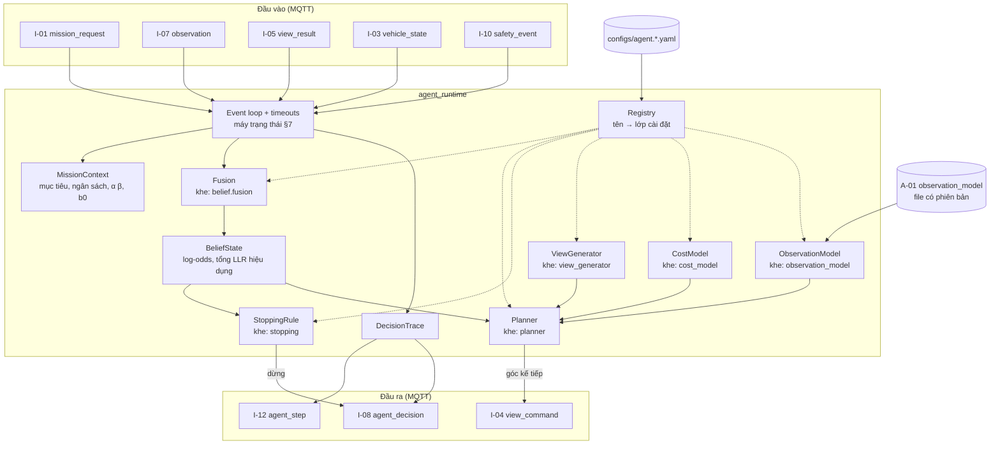
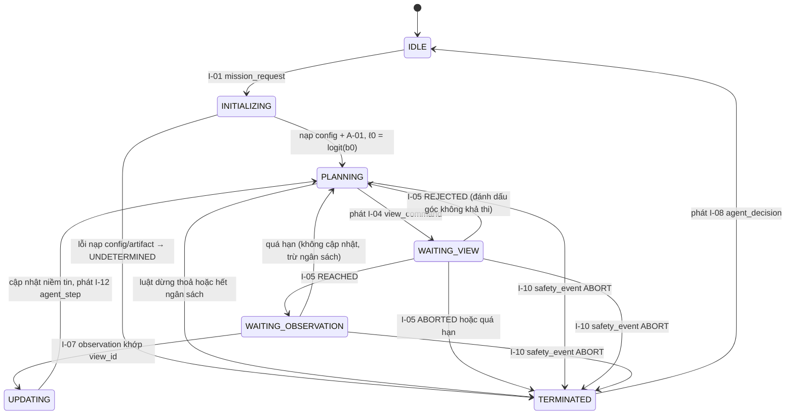

# Module `agents/` — Tác tử onboard

| | |
|---|---|
| Owner | AGT |
| Bài toán thành phần | **P-AGT**: từ chuỗi quan sát, duy trì niềm tin và chọn hành động tiếp theo (góc nhìn kế tiếp hoặc kết luận) theo chi phí và ràng buộc rủi ro |
| Chạy ở đâu | Máy tính đồng hành trên UAV (bắt buộc với MVP) |
| Yêu cầu PRD | FR-AGT-01 … FR-AGT-10 |
| Trạng thái | Thiết kế v3.0 cho MVP |

> **Đây là module mang "tính tác tử" — mốc MVP.** Ba quyết định của module này không ai lập trình sẵn: **nhìn ở đâu tiếp**, **nhìn tiếp hay dừng**, **kết luận gì**. Mọi phương pháp cho ba quyết định đó đều **cắm được** (registry) và **chọn bằng config**.

---

## 1. Phạm vi

**Làm:**
- Khởi tạo niềm tin từ `mission_request.prior.b0`.
- Sinh tập góc nhìn ứng viên từ config và loại các góc đã bị embedded từ chối.
- Cập nhật niềm tin từ `observation`.
- Chọn góc kế tiếp hoặc kết luận (`SMOKE_CONFIRMED` / `NO_SMOKE` / `UNDETERMINED`).
- Xử lý mọi nhánh ngoại lệ: từ chối, quá hạn, quan sát kém, sự kiện an toàn.
- Phát vết quyết định giải thích được (`agent_step`, `agent_decision`).
- Cung cấp **bộ mô phỏng quan sát L0** và **benchmark chính sách** (baseline + chính sách MVP).

**Không làm** (vi phạm là lỗi kiến trúc):
- Không đọc pixel, không chạy mô hình thị giác.
- Không gửi MAVLink, toạ độ GPS hay độ cao tuyệt đối. Chỉ gửi `view_spec` tương đối mục tiêu ([00-overview §8.3](00-overview.md)).
- Không tự đặt prior. Không cộng b₀ quá một lần.
- Không diễn giải vận hành (cháy rừng hay đốt nương). Đó là việc của backend.
- Không bỏ qua `REJECTED` hay `safety_event`.

---

## 2. Hợp đồng vào/ra

| Hướng | Mã | Thông điệp | Agent dùng để làm gì |
|---|---|---|---|
| Vào | I-01 | `mission_request` | `prior.b0`, `risk_targets` (α, β), `budget`, `target`, `profiles.agent` |
| Vào | I-03 | `vehicle_state` | `on_station_margin_s`, vị trí hiện tại (để ước lượng chi phí bay) |
| Vào | I-05 | `view_result` | Biết góc nhìn đã đạt / bị từ chối / bị huỷ |
| Vào | I-07 | `observation` | `llr`, `valid`, `context` để cập nhật niềm tin |
| Vào | I-10 | `safety_event` | `severity = ABORT` thì kết thúc ngay |
| Vào | A-01 | `observation_model` (file) | Mô hình dự báo LLR theo ngữ cảnh góc nhìn (để lập kế hoạch) + tham số tương quan τ |
| Ra | I-04 | `view_command` | Góc nhìn kế tiếp |
| Ra | I-12 | `agent_step` | Vết sống mỗi bước |
| Ra | I-08 | `agent_decision` | Kết luận cuối + toàn bộ vết |

---

## 3. Kiến trúc nội bộ



Mỗi khối có nhãn `khe:` là một **interface** với nhiều cài đặt chọn bằng tên trong config (§5).

---

## 4. Mô hình tính toán (mức cài đặt)

### 4.1 Trạng thái

- ℓ_t: log-odds của niềm tin, b_t = σ(ℓ_t).
- Λ_t: tổng LLR hiệu dụng đã cộng (không gồm prior).
- Tập góc đã nhìn, đã bị từ chối; ngân sách còn lại (số góc, thời gian trên trạm); `on_station_margin_s` mới nhất từ embedded.

### 4.2 Khởi tạo

ℓ₀ = logit(b₀), Λ₀ = 0. b₀ lấy **duy nhất** từ `mission_request.prior.b0`.

### 4.3 Cập nhật niềm tin (khe `belief.fusion`)

Với quan sát hợp lệ có `llr` = L_t:

ℓ_{t+1} = ℓ_t + w_t · L_t, Λ_{t+1} = Λ_t + w_t · L_t

| Cài đặt | w_t | Khi nào dùng |
|---|---|---|
| `naive_bayes` | 1 | Baseline. Giả định các góc nhìn độc lập (thường **sai**, dẫn tới quá tự tin) |
| `tempered_bayes` | τ ∈ (0, 1], lấy từ `A-01.inter_view_correlation.tempering_tau` | **Mặc định MVP**. Bù tương quan giữa các góc nhìn của cùng một cột khói |
| `kernel_tempered` | τ phụ thuộc khoảng cách góc tới các góc đã nhìn (kernel trong A-01) | Khi dữ liệu cho thấy tương quan giảm theo độ lệch góc |
| `learned_gru` | Bộ tổng hợp học được trên chuỗi quan sát | Nghiên cứu (RRD RQ2) |

Quan sát `valid = false` hoặc `llr = null` thì **không cập nhật** niềm tin, nhưng vẫn trừ ngân sách.

### 4.4 Luật dừng và kết luận (khe `stopping`)

| Cài đặt | Quy tắc | Tham số đến từ đâu | Trạng thái |
|---|---|---|---|
| `sprt_wald` | Dừng `SMOKE_CONFIRMED` khi Λ ≥ ln((1−β)/α); dừng `NO_SMOKE` khi Λ ≤ ln(β/(1−α)) | α, β từ `mission_request.risk_targets` (PRD KPI) | **Mặc định MVP** |
| `posterior_thresholds` | Dừng khi b_t ≥ 1 − α_post hoặc b_t ≤ β_post (có dùng b₀) | α_post, β_post từ risk_targets | Phương án khi muốn prior GIS ảnh hưởng đến dừng |
| `conformal_calibrated` | Ngưỡng trên Λ hiệu chỉnh bằng *conformal risk control* trên dữ liệu phát lại để bảo đảm tỷ lệ bỏ sót ≤ β | Artifact ngưỡng do AGT sinh từ benchmark | V1 |
| `dp_belief` | Bảng chính sách tối ưu từ quy hoạch động trên lưới niềm tin | Artifact bảng chính sách | Baseline trần tối ưu / V1 |

**Vì sao mặc định là `sprt_wald`:** thông số đầu vào chính là hai mục tiêu rủi ro của sản phẩm (α báo nhầm, β bỏ sót), không cần thêm hằng số chi phí chọn tay. Prior b₀ không bị dùng hai lần (b₀ vẫn dùng cho planner và cho niềm tin báo cáo). Ngưỡng Wald là xấp xỉ khi có tương quan và sai mô hình, nên V1 thay bằng `conformal_calibrated`.

**Kết thúc `UNDETERMINED`** (lý do ghi trong `agent_decision.reason`):

| Lý do | Điều kiện |
|---|---|
| `BUDGET_EXHAUSTED` | Hết số góc nhìn, hết thời gian trên trạm, hoặc `on_station_margin_s` thấp hơn chi phí của mọi góc khả thi |
| `LOW_QUALITY` | Số quan sát không hợp lệ liên tiếp ≥ `abstain.max_consecutive_invalid` |
| `VIEW_INFEASIBLE` | Mọi góc ứng viên đã bị từ chối hoặc không khả thi |
| `OBSERVATION_TIMEOUT` | Số lần chờ quan sát quá hạn ≥ `abstain.max_observation_timeouts` |
| `SAFETY_ABORT` / `MISSION_CANCELLED` / `LINK_LOSS` | Nhận `safety_event` mức `ABORT` |
| `POLICY_ABSTAIN` | Planner ước lượng không thể vượt ngưỡng trong ngân sách còn lại (tuỳ chọn, V1) |

### 4.5 Chọn góc nhìn kế tiếp (khe `planner`)

Mô hình quan sát dự báo (khe `observation_model`, nạp từ A-01) cho phân phối p(L | H, ngữ cảnh(v)), trong đó ngữ cảnh gồm cự ly, góc mặt trời tương đối, độ cao, tỷ lệ che khuất dự kiến.

**Mặc định MVP — `chernoff_kl_per_cost`** (test chủ động Chernoff 1959; Naghshvar & Javidi 2013):

v* = argmax_v [ KL( p(L | Ĥ, v) ‖ p(L | H̄, v) ) · d(v | lịch sử) ] / cost(v)

- Ĥ là giả thuyết đang có khả năng cao nhất, H̄ là giả thuyết còn lại.
- d(v | lịch sử) ∈ (0, 1] là hệ số giảm cho góc gần các góc đã nhìn (từ kernel tương quan trong A-01; = 1 nếu không có).
- cost(v) lấy từ `cost_model` (§4.6).

Lý do chọn làm mặc định: có cơ sở lý thuyết (tối ưu tiệm cận cho kiểm định giả thuyết chủ động), không cần hằng số chi phí chọn tay, tính trong vài mili-giây, giải thích được ("chọn góc này vì kỳ vọng phân biệt tốt nhất trên mỗi giây bay").

### 4.6 Mô hình chi phí (khe `cost_model`)

| Cài đặt | cost(v) | Trạng thái |
|---|---|---|
| `constant` | 1 mỗi góc | Baseline (giống `c_hover` của bản v2) |
| `flight_time` | quãng bay (từ vị trí hiện tại, theo `vehicle_state`) / tốc độ ước lượng + `settle_s` + `hover_s` | **Mặc định MVP** |
| `energy` | Năng lượng ước lượng (cần mô hình tiêu thụ từ log bay thật) | V1 |

---

## 5. Danh mục phương pháp — không hardcode, chọn bằng config

| Khe | Ứng viên (tên registry) | Vai trò | Khi nào nên dùng | Tham khảo |
|---|---|---|---|---|
| `belief.fusion` | `naive_bayes` · **`tempered_bayes`** · `kernel_tempered` · `learned_gru` | Gộp bằng chứng | Mặc định `tempered_bayes`; `learned_gru` cho nghiên cứu | RRD RQ2 |
| `observation_model` | `global_gaussian` · **`binned_gaussian`** · `binned_histogram` · `learned` | Dự báo LLR theo góc nhìn để lập kế hoạch | `binned_gaussian` khi mỗi bin đủ mẫu; `global_gaussian` khi dữ liệu ít | A-01 |
| `view_generator` | **`lattice`** · `lattice_with_feasibility_memory` · `continuous_sampler` | Sinh ứng viên | `lattice` cho MVP (dễ kiểm định an toàn) | — |
| `planner` | `single_shot` (B1) · `fixed_orbit` (B2) · `greedy_info_gain` (B3) · `fixed_view_sprt` (B4) · **`chernoff_kl_per_cost`** · `ec2` · `dp_belief` (B7) · `pomcp` (B8) · `ppo` | Chọn góc | Mặc định Chernoff; B1–B4 luôn chạy được để so sánh; `dp_belief` làm trần tối ưu; `pomcp`/`ppo` cho V1/nghiên cứu | Chernoff 1959; Naghshvar & Javidi 2013; Golovin et al. 2010 (EC²); Kartik et al. 2018 |
| `stopping` | **`sprt_wald`** · `posterior_thresholds` · `conformal_calibrated` · `dp_belief` | Dừng và kết luận | Mặc định `sprt_wald`; V1 `conformal_calibrated` | Wald 1945; Angelopoulos et al. ICLR 2024 |
| `cost_model` | `constant` · **`flight_time`** · `energy` | Chi phí mỗi góc | — | — |

**Quy tắc:** thêm ứng viên mới = thêm lớp + đăng ký tên + test đơn vị + chạy benchmark L0 so với các baseline. **Không sửa** `agent_runtime`.

---

## 6. Cấu hình

File mặc định: [`agents/configs/agent.default.yaml`](../../agents/configs/agent.default.yaml). Profile được chọn qua `mission_request.profiles.agent`. Ví dụ rút gọn:

```yaml
planner:
  method: chernoff_kl_per_cost      # đổi sang fixed_orbit để chạy baseline B2
stopping:
  method: sprt_wald
  alpha_false_alarm: from_mission   # lấy từ mission_request.risk_targets
  beta_miss: from_mission
belief:
  fusion: tempered_bayes
  tempered_bayes:
    tau: from_artifact               # A-01.inter_view_correlation.tempering_tau
    tau_fallback: 1.0                # chỉ khi thiếu artifact; BẮT BUỘC ghi cảnh báo vào trace
```

Giá trị như lưới góc nhìn (8 phương vị × 3 cự ly × 2 độ cao) là **giá trị khởi điểm cần kiểm chứng** (PRD), đặt trong config, không đặt trong code.

---

## 7. Vòng đời runtime



- Mọi trạng thái chờ có **timeout trong config** (`timeouts.view_result_s`, `timeouts.observation_s`).
- `safety_event` mức `ABORT` được xử lý **ở mọi trạng thái** và có ưu tiên cao nhất.
- Chỉ một nhiệm vụ tại một thời điểm. `mission_request` mới khi đang bận thì bị từ chối và ghi log.

---

## 8. Giải trình — nội dung bắt buộc của vết quyết định

Mỗi `agent_step` (I-12) chứa:
- Niềm tin trước và sau (b, ℓ, Λ).
- LLR thô và LLR hiệu dụng của quan sát vừa dùng.
- Top-k góc ứng viên kèm điểm số, chi phí, khả thi hay không.
- Hành động được chọn và **câu lý do** sinh từ dữ liệu, ví dụ: "chọn phương vị 135°, cự ly 150 m vì KL kỳ vọng/giây cao nhất (0,042/s); góc 90° bị từ chối: TERRAIN_CLEARANCE".
- Cảnh báo, ví dụ "dùng tau_fallback = 1.0 vì thiếu A-01".
- `provenance`: tên các phương pháp, `config_hash`, phiên bản A-01.

`agent_decision` (I-08) chứa toàn bộ chuỗi `agent_step`, ngưỡng đã dùng và cách suy ra ngưỡng.

---

## 9. Mô phỏng L0 và benchmark (owner AGT)

**Môi trường `ActiveVerificationEnv` (Gymnasium)** nằm trong `agents/sim/`:

| Thành phần | Mô tả | Nguồn tham số |
|---|---|---|
| Sinh kịch bản | H ~ Bernoulli(b₀); mục tiêu; vị trí mặt trời; bản đồ che khuất theo phương vị (địa hình, tán rừng) | Config kịch bản |
| Sinh quan sát | L ~ p(L \| H, ngữ cảnh(v)) từ A-01, cộng **nhiễu tương quan** giữa các góc (Gaussian copula, kernel theo độ lệch góc) | A-01 + tham số ρ để quét độ nhạy |
| Quan sát hỏng | Xác suất `valid = false` theo ngữ cảnh (ngược nắng, xa) | A-01 hoặc config |
| Chi phí | Thời gian bay theo khoảng cách + settle + hover; ngân sách thời gian trên trạm | Config, sau này từ log bay |
| Từ chối | Mặt nạ góc không khả thi (giả lập geofence/địa hình) | Config kịch bản |

**Benchmark** chạy mọi `planner` × `stopping` trên cùng bộ kịch bản (cùng seed) và báo cáo:
- Độ chính xác trên phần tự quyết.
- Tỷ lệ tự quyết (1 − tỷ lệ `UNDETERMINED`).
- Tỷ lệ bỏ sót so với β mục tiêu.
- N_views trung bình và phân phối của nó.
- Thời gian quyết định (gồm thời gian bay).
- Đường cong coverage–accuracy.
- Độ nhạy theo ρ.

Đây vừa là công cụ chọn phương pháp, vừa là nền cho paper A trong [RRD §9](../02-RRD.md).

**Thí nghiệm bắt buộc trước khi đầu tư vào RL:** so sánh `dp_belief` (tối ưu khi biết mô hình) với `chernoff_kl_per_cost` và `ppo`. Nếu PPO chỉ tiến về DP, RL không phải đóng góp chính (RRD RQ3).

---

## 10. Kiểm thử và tiêu chí hoàn thành MVP

| Loại | Nội dung | Tiêu chí |
|---|---|---|
| Đơn vị | Toán fusion, ngưỡng Wald, KL giữa hai Gaussian, mô hình chi phí | Đúng tới 1e-9 so với lời giải tay |
| Hợp đồng | Mọi thông điệp phát ra validate được theo schema trong `docs/interfaces/schemas` | 100% |
| Nhánh ngoại lệ | Mỗi dòng của bảng §4.4 và bảng ngoại lệ trong [00-overview §6](00-overview.md) | Mỗi nhánh có test |
| Phát lại | Chạy lại từ `message_log.jsonl` ra đúng chuỗi `agent_step` | Giống hệt (cùng config, cùng seed) |
| Hiệu năng | Một bước quyết định trên RPi 5 | ≤ 50 ms với lưới ≤ 100 góc |
| Benchmark L0 | Chính sách MVP so với B2 (orbit cố định) | KPI MVP trong [PRD §8](../01-PRD.md) |

---

## 11. Rủi ro và câu hỏi mở

| Rủi ro | Giảm thiểu |
|---|---|
| A-01 chưa có hoặc ít dữ liệu (đặc biệt dữ liệu UAV đa góc) | `global_gaussian` + τ thận trọng; ưu tiên chiến dịch thu dữ liệu (PRD) |
| Tương quan thực tế mạnh hơn giả định gây dừng sớm sai | Quét ρ trong L0; V1 dùng `conformal_calibrated` |
| Toạ độ cảnh báo lệch khiến mục tiêu ngoài khung hình | MVP giả định sai số vị trí ≤ `location_uncertainty_m` cho phép (PRD A-1); CV báo `target_in_fov`; V2 mở rộng tìm kiếm |
| Planner chọn góc mà embedded thường xuyên từ chối | `lattice_with_feasibility_memory`; EMB công bố trước lưới khả thi (V1) |

**Câu hỏi mở:** dùng b₀ trong luật dừng hay không (`sprt_wald` hay `posterior_thresholds`) — quyết định sau khi có số liệu thực địa (PRD Q-3).

---

## 12. Cấu trúc thư mục gợi ý

```
agents/
├── README.md
├── configs/            # agent.default.yaml, profile khác, kịch bản L0
├── src/uav_agent/      # runtime, belief/, planners/, stopping/, cost/, registry.py, trace.py, io_mqtt.py
├── sim/                # ActiveVerificationEnv, sinh kịch bản, benchmark
└── tests/              # unit, contract (validate theo schema), replay, ngoại lệ
```
