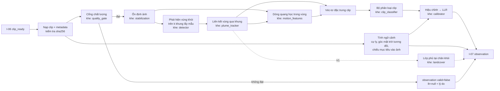
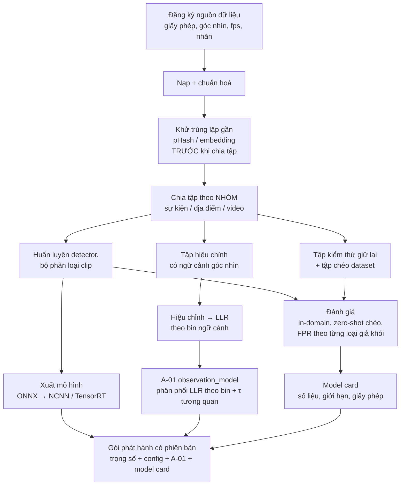

# Module `cv/` — Thị giác máy tính

| | |
|---|---|
| Owner | CV |
| Bài toán thành phần | **P-CV**: biến **một clip** có siêu dữ liệu thành **một quan sát đã hiệu chỉnh** (LLR về khói + cờ chất lượng + ngữ cảnh). Offline: sinh artifact `observation_model` cho agent |
| Chạy ở đâu | Onboard (máy tính đồng hành) **hoặc** mặt đất, chọn bằng config ([ADR-005](90-decisions.md)) |
| Yêu cầu PRD | FR-CV-01 … FR-CV-10 |
| Phần cứng | **Chỉ RGB, không nhiệt** ([ADR-006](90-decisions.md)) |

---

## 1. Phạm vi

**Làm:**
- Dịch vụ `perception_service`: nhận `clip_ready`, trả `observation`.
- Pipeline dữ liệu: đăng ký nguồn, giấy phép, khử trùng lặp, chia tập theo nhóm, gắn nhãn, đánh giá.
- Huấn luyện, hiệu chỉnh xác suất, xuất mô hình cho từng thiết bị.
- Sinh artifact **A-01 `observation_model`** (mô hình LLR theo ngữ cảnh góc nhìn + tương quan giữa các góc) cho agent.
- Stub `fake_perception` phát `observation` hợp lệ theo kịch bản để các module khác test.
- (V1) Phân đoạn lớp phủ đất tại chân cột khói.

**Không làm:**
- Không kết luận nhiệm vụ, không phát cảnh báo, không quyết định bay đâu.
- Không cộng prior. **Không xuất posterior vào trường `llr`** (§5).
- Không đọc hay ghi MAVLink. Mọi tư thế camera lấy từ `clip_ready`.

---

## 2. Hợp đồng vào/ra

| Hướng | Mã | Thông điệp / artifact | Ghi chú |
|---|---|---|---|
| Vào | I-06 | `clip_ready` | `uri` dạng `file://` (onboard) hoặc `https://` (mặt đất); tư thế, intrinsics, vị trí mục tiêu, mặt trời |
| Ra | I-07 | `observation` | Một quan sát cho một clip, khớp `view_id` + `clip_id` |
| Ra | A-01 | `observation_model` | File JSON có phiên bản, phát hành cùng mỗi bản mô hình |

---

## 3. Kiến trúc online — `perception_service`



### Ý nghĩa vật lý của các đặc trưng (vì sao không dùng "trừ khung hình" như VMOKED)

| Hiện tượng | Khói từ đám cháy | Sương / mây thấp | Bụi đường | Hơi nước sau mưa |
|---|---|---|---|---|
| Hướng chuyển động chính | **Bốc lên**, lệch theo gió | Trôi ngang theo gió | Ngang, sát mặt đất, ngắn | Bốc lên chậm, phân tán rộng |
| Nguồn | **Có điểm/vùng nguồn** cố định | Không có nguồn | Theo vệt xe | Diện rộng |
| Độ nở (divergence) | Dương, tăng theo độ cao | Gần 0 | Dương, tắt nhanh | Nhỏ |
| Độ trong suốt | Bán trong suốt, che dần nền | Che đều, mờ diện rộng | Đục, ngắn | Mờ nhẹ |

Đặc trưng MVP vì vậy là **dòng quang học sau khi ổn định ảnh** (thành phần thẳng đứng, divergence, độ đồng hướng, điểm hội tụ ngược về nguồn) cộng thống kê của detector. Không dùng độ sai khác khung hình thuần, vì sương trôi cũng tạo ra sai khác. Kiểm tra mã VMOKED cho thấy module chuyển động của nó chỉ là trừ khung hình với ngưỡng cố định ([báo cáo rà soát](../research/2026-10-02-danh-gia-dac-ta-v2.md) §3).

**Ngân sách độ trễ:** ≤ 5 s mỗi clip onboard, ≤ 15 s ở mặt đất kể cả tải clip (NFR-07). Chu kỳ quyết định là hàng chục giây nên không cần xử lý mọi khung. Lấy mẫu k khung theo config.

---

## 4. Kiến trúc offline — dữ liệu, huấn luyện, hiệu chỉnh



---

## 5. Định nghĩa LLR và hợp đồng hiệu chỉnh (CV ↔ AGT) — đọc kỹ

### 5.1 Định nghĩa

`observation.llr` = ln p(z | H₁ = SMOKE, c) − ln p(z | H₀ = NO_SMOKE, c), trong đó z là đầu ra pipeline cho **một clip**, c là ngữ cảnh góc nhìn. Logarit tự nhiên.

- LLR > 0: clip ủng hộ có khói. LLR < 0: ủng hộ không khói. LLR = 0: trung tính.
- **LLR không phụ thuộc prior.** Nếu bộ phân loại sau hiệu chỉnh cho xác suất hậu nghiệm q trên tập hiệu chỉnh có tỷ lệ dương π_cal, thì:

  **LLR = logit(q) − logit(π_cal)**

  Quên trừ logit(π_cal) là lỗi tích hợp số 1 ([00-overview §14](00-overview.md)).
- Chặn LLR trong [−`llr_clip`, +`llr_clip`] (config) để tránh quá tự tin do một clip. Giá trị chặn ghi vào `provenance`.

### 5.2 Khi nào `valid = false`

`valid = false` và `llr = null` khi clip **không mang thông tin đáng tin**. Lý do (`invalid_reasons`): `BLUR`, `OVEREXPOSED`, `UNDEREXPOSED`, `SUN_GLARE`, `TARGET_OUT_OF_FOV`, `DECODE_ERROR`, `INSUFFICIENT_FRAMES`, `PROCESSING_TIMEOUT`.

> "Nhìn kỹ và không thấy khói" là **quan sát hợp lệ** với LLR âm. "Không nhìn được" là `valid = false`. Hai trường hợp này **không được** trộn lẫn.

### 5.3 Ngữ cảnh `context`

| Trường | Cách tính | MVP |
|---|---|---|
| `range_m` | Khoảng cách 3D camera–mục tiêu từ `clip_ready` | Có |
| `height_above_target_m` | Từ `clip_ready.view` | Có |
| `sun_rel_azimuth_deg` | \|wrap(yaw camera − phương vị mặt trời)\| ∈ [0, 180]. **0 = nhìn thẳng vào mặt trời (ngược nắng)** | Có |
| `sun_elevation_deg` | Từ `clip_ready.sun` | Có |
| `target_in_fov` | Chiếu mục tiêu vào ảnh bằng tư thế + intrinsics | Có |
| `base_occlusion_ratio` | Tỷ lệ vùng chân khói bị tán cây/địa hình che | V1 (`null` ở MVP) |

### 5.4 Artifact A-01 `observation_model`

CV sinh A-01 từ **tập hiệu chỉnh có ngữ cảnh góc nhìn** (schema: [observation_model.schema.json](../interfaces/schemas/observation_model.schema.json)):

1. Chia ngữ cảnh thành bin (ví dụ cự ly × góc mặt trời tương đối). Biên bin đặt trong config CV.
2. Với mỗi bin và mỗi giả thuyết, ước lượng phân phối LLR (`GAUSSIAN` hoặc `HISTOGRAM`) kèm số mẫu. Bin thiếu mẫu (< `min_samples_per_bin`) dùng phân phối `fallback` toàn cục.
3. Xác suất `valid = false` theo bin.
4. **Tương quan giữa các góc nhìn**: trên các chuỗi đa góc của cùng một sự kiện, ước lượng tương quan ρ của phần dư LLR theo độ lệch góc. Từ đó suy ra `tempering_tau`, ví dụ τ = 1 / (1 + (n̄ − 1)·ρ̄) với n̄ là số góc điển hình. Khi chưa có dữ liệu đa góc, đặt `method = "assumed"` và ghi rõ trong `notes`.
5. Ghi `provenance`: phiên bản pipeline, git SHA, danh sách dataset và phiên bản, số clip.

**A-01 phải đi cùng phiên bản mô hình đã sinh ra nó.** `observation.observation_model_version` phải trùng `A-01.version` mà agent đang dùng. Nếu lệch, agent ghi cảnh báo.

---

## 6. Danh mục phương pháp — không hardcode, chọn bằng config

| Khe | Ứng viên (tên registry) | Mặc định MVP | Lý do / lưu ý |
|---|---|---|---|
| `quality_gate` | **`heuristic_gate`** (phương sai Laplacian, histogram phơi sáng, hình học mặt trời) · `learned_gate` | `heuristic_gate`, ngưỡng trong config | Rẻ, giải thích được; V1 học từ nhãn |
| `stabilization` | `none` · `gimbal_pose_comp` · **`ecc_affine`** · `orb_homography` | `ecc_affine` (OpenCV) | Hover vẫn trôi vài pixel. Cảnh xa nên affine/homography là đủ |
| `detector` | `yolo11` / `yolo26` (n, s) · `rtdetrv2_s` · `dfine_s` · `deim_s` · `yoloe` (zero-shot) · `vsmoked` (chỉ baseline) | `yolo11n`/`yolo26n` cho nguyên mẫu | Ultralytics là **AGPL-3.0**; D-FINE/DEIM/RT-DETRv2 là **Apache-2.0**, an toàn hơn cho sản phẩm. **Không** dùng trọng số YOLO-NAS (phi thương mại) |
| `plume_tracker` | **`iou_tracker`** · `bytetrack` · `edgetam` | `iou_tracker` | Clip ngắn, ít đối tượng; EdgeTAM khi cần mặt nạ |
| `motion_features` | `frame_diff` (baseline giống VMOKED) · **`dis_flow`** (OpenCV DIS) · `farneback` · `raft_small` · `neuflow` | `dis_flow` | Chạy nhanh trên CPU (RPi 5); RAFT/NeuFlow khi có GPU |
| `clip_classifier` | `logistic` · **`gbdt`** · `tsm_mobilenetv2` · `x3d_xs` · `movinet_a0` | `gbdt` trên đặc trưng detector + flow + màu/độ tương phản | Ít dữ liệu, giải thích được (độ quan trọng đặc trưng); mô hình video học sâu khi đủ dữ liệu UAV |
| `calibrator` | `platt` · `temperature` · **`isotonic_binned`** · `beta` | `isotonic_binned` theo bin ngữ cảnh | Bắt buộc để LLR có nghĩa |
| `landcover` (V1) | `segformer_b0` · `pidnet_s` · `dinov2_s_linear` · `open_vocab` | — | Huấn luyện trên **ảnh drone xiên** (VDD, UAVid, IDD) + dữ liệu Việt Nam. LoveDA/OpenEarthMap là ảnh trực giao, chỉ dùng để pre-train |
| `runtime` | `onnxruntime` · **`ncnn`** (RPi 5) · **`tensorrt`** (Jetson) · `hailort` | Theo biến thể phần cứng | Cùng một mô hình, nhiều backend xuất |

Tham khảo hiệu năng: YOLO11n xuất NCNN chạy khoảng 70–80 ms/khung 640 trên RPi 5 ([Ultralytics RPi](https://docs.ultralytics.com/guides/raspberry-pi)). YOLO26n TensorRT FP16 khoảng 4,6 ms trên Jetson Orin Nano Super ([Ultralytics Jetson](https://docs.ultralytics.com/guides/nvidia-jetson)). Với k ≈ 8–16 khung mỗi clip, cả hai biến thể đều nằm trong ngân sách §3.

---

## 7. Dữ liệu

### 7.1 Nguồn (chi tiết và giấy phép trong `cv/data/README.md`)

| Nguồn | Góc nhìn | Dùng cho | Lưu ý |
|---|---|---|---|
| FIgLib (HPWREN) | Chòi canh, **khoảng 1 khung/phút** | Detector, mẫu âm khó (ngày sương/mây trong kho HPWREN) | Động học theo phút, **không** giống clip hover 2 s |
| PyroNear-2024/2025, pyro-sdis | Chòi canh / web | Detector, mô hình chuỗi | — |
| Boreal Forest Fire | **UAV**, có video | Detector + đặc trưng chuyển động từ UAV | Rừng phương Bắc, khác thảm thực vật Việt Nam |
| FLAME 1/2/3 | **UAV** | Khói/lửa từ đốt có kiểm soát | Phần nhiệt không dùng (không có camera nhiệt) |
| FASDD (phần UAV) | UAV | Detector | **90,7% ảnh test có bản gần-trùng trong train**: phải khử trùng lặp lại |
| D-Fire | Hỗn hợp | Detector | 46,0% ảnh test gần-trùng |
| WSDataset (nhóm VMOKED) | Camera cố định | Baseline VMOKED | Chưa rõ giấy phép và link |
| **Tự thu tại Việt Nam** | **UAV đa góc, hover 1–4 s** | Tập hiệu chỉnh A-01, tập test chính, mẫu âm khó (sương sớm, mây thấp, bụi, hơi nước), khói đốt thực bì có phép | Ưu tiên số 1. Quy trình thu trong PRD §10 |

### 7.2 Quy tắc bắt buộc

1. **Khử trùng lặp gần trước khi chia tập**, rồi chia theo **nhóm** (sự kiện, địa điểm, video). Không bao giờ chia ngẫu nhiên theo khung.
2. **Luôn đánh giá mẫu âm.** Báo cáo FPR riêng cho từng loại giả khói. Bộ đánh giá công khai của VMOKED bỏ qua mẫu âm; không lặp lại lỗi đó.
3. Báo cáo **zero-shot chéo dataset** bên cạnh in-domain.
4. Báo cáo **độ hiệu chỉnh** (ECE, reliability diagram) theo bin ngữ cảnh.
5. VMOKED chỉ là **baseline**, chạy lại bằng bộ đánh giá của dự án.

---

## 8. Triển khai

- **Một mã nguồn dịch vụ cho cả onboard và mặt đất.** Khác nhau ở config (`runtime`, `io.clip_fetch`), không ở code.
- Gói phát hành gồm trọng số, config pipeline, A-01 và model card. Đặt tên theo phiên bản `cv-bundle-<semver>` và lưu ở kho artifact chung (GitHub Release / ổ chia sẻ), **không commit trọng số vào git**.
- Dịch vụ chạy dưới nền tảng do EMB cung cấp (systemd/container), xem [30-embedded §8](30-embedded.md).

---

## 9. Kiểm thử và tiêu chí hoàn thành MVP

| Loại | Tiêu chí |
|---|---|
| Hợp đồng | 100% `observation` và A-01 phát ra validate theo schema |
| Định nghĩa LLR | Test xác nhận LLR không đổi khi thay tỷ lệ dương của tập hiệu chỉnh (đã trừ logit(π_cal)) |
| `valid = false` | Mỗi `invalid_reason` có clip test tương ứng |
| Hiệu năng | Đo độ trễ mỗi clip trên thiết bị đích; đạt ngân sách §3 |
| Chất lượng | Báo cáo theo §7.2 trên tập test giữ lại; số mục tiêu chốt sau khi có dữ liệu thực địa (PRD KPI) |
| Stub | `fake_perception` phát quan sát theo kịch bản (H, cự ly, góc mặt trời) để EMB/AGT/BE test |

---

## 10. Rủi ro và câu hỏi mở

| Rủi ro | Giảm thiểu |
|---|---|
| Thiếu dữ liệu UAV đa góc ở Việt Nam | Chiến dịch thu dữ liệu sớm (PRD); bắt đầu bằng Boreal/FLAME + thu thử với drone giá rẻ |
| Lệch miền chòi canh → UAV | Đánh giá zero-shot; tinh chỉnh bằng dữ liệu tự thu |
| Giấy phép mô hình | Chốt detector trước khi lên sản phẩm (AGPL hay Apache) — PRD Q-4 |
| Ngược nắng, mây trắng sát tán rừng | Đưa `sun_rel_azimuth_deg` vào ngữ cảnh; FPR theo loại giả khói |

---

## 11. Cấu trúc thư mục gợi ý

```
cv/
├── README.md
├── configs/        # pipeline.default.yaml, profile theo thiết bị
├── data/           # README.md = đăng ký nguồn + giấy phép (KHÔNG commit dữ liệu)
├── src/uav_cv/     # service/, quality/, stabilize/, detect/, track/, motion/, classify/, calibrate/, registry.py
├── training/       # script huấn luyện, khử trùng lặp, chia tập, đánh giá, sinh A-01
└── tests/          # contract, LLR, valid=false, latency, stub fake_perception
```
