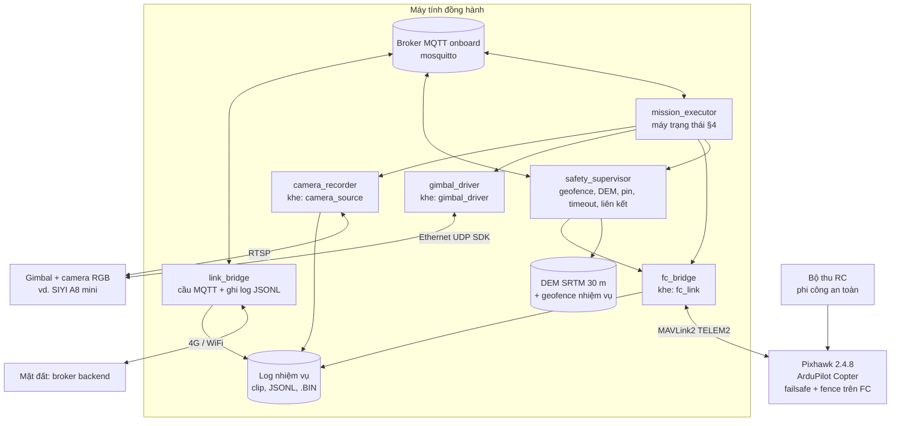
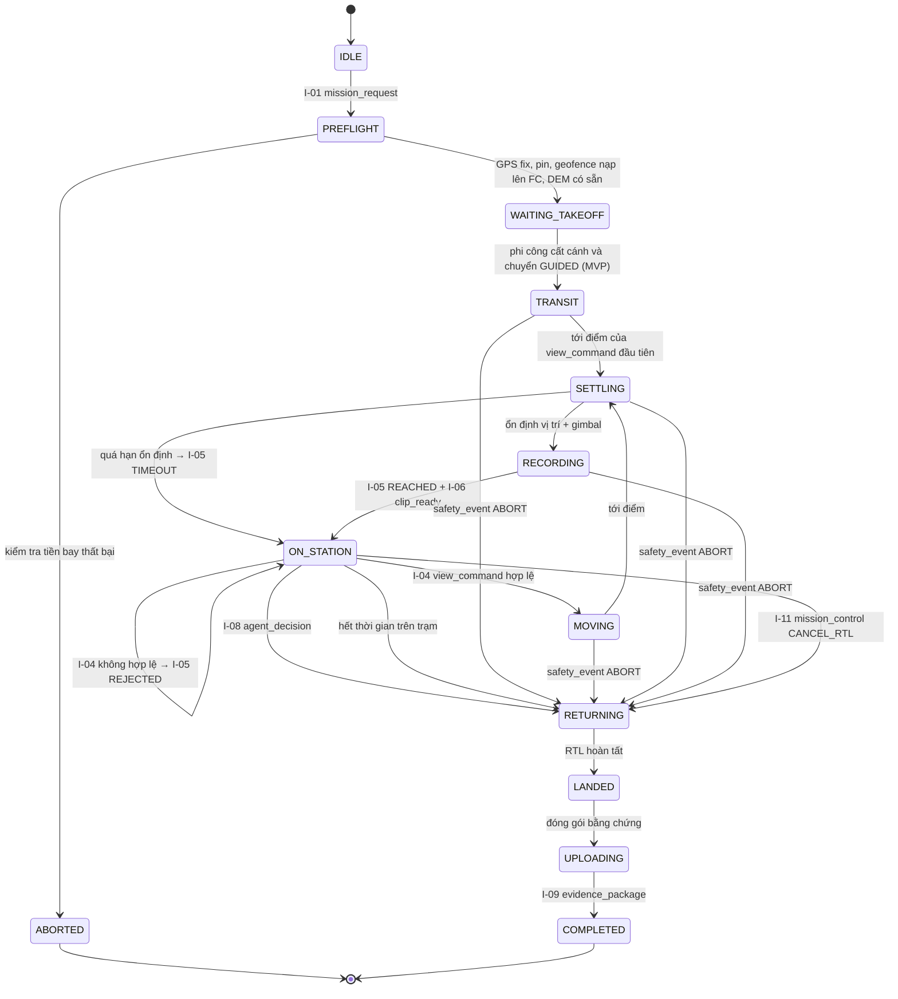
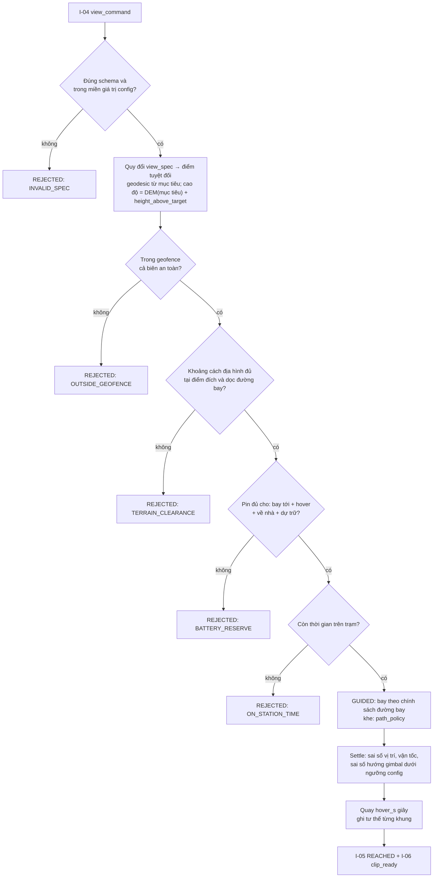

# Module `embedded/` — Nhúng: bay, an toàn, camera, nền tảng onboard

| | |
|---|---|
| Owner | EMB |
| Bài toán thành phần | **P-EMB**: đưa camera tới **đúng góc nhìn được yêu cầu một cách an toàn**, rồi quay một **clip ổn định có đủ siêu dữ liệu** |
| Chạy ở đâu | Pixhawk 2.4.8 (firmware) + máy tính đồng hành (dịch vụ) |
| Yêu cầu PRD | FR-EMB-01 … FR-EMB-11 |
| Phần cứng | [60-hardware](60-hardware.md); quyết định firmware [ADR-001](90-decisions.md) |

> Module này giữ **thẩm quyền an toàn** ([ADR-008](90-decisions.md)). Agent chỉ đề xuất góc nhìn; embedded **kiểm tra, rồi thực thi hoặc từ chối có lý do**. Embedded **không bao giờ** tự sửa lệnh thành lệnh khác mà không báo.

---

## 1. Phạm vi

**Làm:**
- Cấu hình firmware ArduPilot trên Pixhawk 2.4.8 (tham số, failsafe, geofence trên FC).
- `fc_bridge`: giao tiếp MAVLink với FC.
- `mission_executor`: máy trạng thái nhiệm vụ, thực thi `view_command`, hover-and-stare.
- `safety_supervisor`: geofence, địa hình (DEM), dự trữ pin, timeout, giám sát liên kết, phát hiện phi công chiếm quyền.
- `gimbal_driver` + `camera_recorder`: khoá gimbal vào mục tiêu, quay clip, ghi tư thế theo từng khung.
- `link_bridge`: cầu MQTT onboard ↔ mặt đất, lưu-rồi-gửi, ghi log mọi thông điệp.
- Đóng gói và tải `evidence_package`.
- **Nền tảng onboard** cho các module khác: OS, broker MQTT, giám sát dịch vụ, đồng bộ thời gian, thư mục log.
- Môi trường SITL/HITL (L1, L2), kể cả camera **phát lại** clip thật theo góc nhìn.
- Sơ đồ đấu nối và danh mục phần cứng.

**Không làm:**
- Không đánh giá có khói hay không. Không chọn góc nhìn.
- Không sửa code dịch vụ của `agents/` hay `cv/`. Chỉ cung cấp nền tảng chạy chúng.
- Không "sửa nhẹ" một `view_command` không an toàn. Phải **từ chối** kèm `reject_reason`.

---

## 2. Hợp đồng vào/ra

| Hướng | Mã | Thông điệp | Ghi chú |
|---|---|---|---|
| Vào | I-01 | `mission_request` | Mục tiêu, geofence, home, ngân sách |
| Vào | I-04 | `view_command` | Từ agent |
| Vào | I-08 | `agent_decision` | Kết thúc quan sát → RTL |
| Vào | I-11 | `mission_control` | Người trực huỷ |
| Ra | I-02 | `mission_status` | Lên backend |
| Ra | I-03 | `vehicle_state` | Cho agent (1–5 Hz); bản thưa lên backend |
| Ra | I-05 | `view_result` | REACHED / REJECTED / ABORTED / TIMEOUT |
| Ra | I-06 | `clip_ready` | Cho CV |
| Ra | I-09 | `evidence_package` | Lên backend sau khi hạ cánh |
| Ra | I-10 | `safety_event` | Cho mọi module |

---

## 3. Kiến trúc nội bộ



---

## 4. Máy trạng thái nhiệm vụ (`mission_executor`)



**`view_command` đầu tiên** (view_id = 0) thường đến khi drone còn ở `PREFLIGHT`/`WAITING_TAKEOFF`. Nó được kiểm tra ngay theo §5 và **giữ chờ**; bị từ chối thì trả `REJECTED` và chờ lệnh khác. Sau khi cất cánh, `TRANSIT` bay tới điểm của lệnh đang chờ.

**Cất cánh ở MVP:** phi công an toàn tự cất cánh và chuyển sang GUIDED (`executor.takeoff_mode: pilot_manual`). Lựa chọn `auto` để dành cho sau khi HITL ổn định. Đây là quyết định an toàn cho bo FC bản clone, không phải giới hạn kỹ thuật.

---

## 5. Xử lý một `view_command` — thứ tự kiểm tra bắt buộc



- **Quy đổi toạ độ ở một chỗ duy nhất** (`geo.py`), dùng thư viện trắc địa (geographiclib/pyproj), có test SITL.
- Độ cao gửi FC: quy về khung mà FC hỗ trợ trên bản build thực tế (ví dụ tương đối điểm home: `alt_rel = alt_amsl_đích − alt_amsl_home`). Chỉ `fc_bridge` biết khung này.
- **Chính sách đường bay** (`path_policy`): `climb_move_descend` (lên độ cao an toàn → di chuyển → xuống) là mặc định; `direct_if_clear` chỉ khi đường thẳng đủ khoảng cách địa hình.
- ArduPilot GUIDED nhận **mục tiêu vị trí** và tự giữ vị trí, **không cần** luồng setpoint liên tục như PX4 Offboard. Lệnh vận tốc hết hạn sau `GUID_TIMEOUT`.

---

## 6. `safety_supervisor` — các lớp bảo vệ

| Lớp | Nơi cưỡng chế | Nội dung | Hành động |
|---|---|---|---|
| Geofence nhiệm vụ (chặt, có biên an toàn) | Companion | Đa giác + độ cao min/max AGL từ `mission_request.geofence` | Từ chối lệnh; vi phạm khi bay → HOLD rồi RTL |
| Geofence FC (lỏng hơn, lớp cuối) | Pixhawk (`FENCE_*`) | Đa giác/bán kính + trần độ cao | RTL do FC |
| Địa hình | Companion | DEM SRTM 30 m + `terrain_margin_m` | Từ chối lệnh |
| Pin | FC (`BATT_*` failsafe) + companion (ước lượng năng lượng về nhà) | Ngưỡng dự trữ | `safety_event` ABORT → RTL |
| Liên kết mặt đất | Companion + FC (`FS_GCS_*`) | Mất liên kết > ngưỡng config | Theo [00-overview §6](00-overview.md); FC xử lý theo tham số |
| Mất RC | FC (`FS_THR_*`) | — | RTL |
| Phi công chiếm quyền | FC → `fc_bridge` phát hiện đổi chế độ không do companion | — | Dừng mọi lệnh tự động; `safety_event` `PILOT_OVERRIDE` |
| Timeout nhiệm vụ | Companion | `budget.max_on_station_s` + tổng thời gian nhiệm vụ | RTL |
| Sức khoẻ companion | systemd watchdog | Dịch vụ treo/chết | Khởi động lại; FC vẫn giữ failsafe pin/RC |

`vehicle_state.on_station_margin_s` = thời gian còn có thể ở trên trạm trước khi **bắt buộc** quay về (đã trừ năng lượng về nhà + dự trữ). Agent dùng con số này để lập kế hoạch. Agent không tự tính pin.

---

## 7. Cấu hình firmware (ArduPilot trên Pixhawk 2.4.8)

- Firmware: **ArduPilot Copter, target `Pixhawk1-1M`** (bo clone 1 MB flash). Kiểm tra trước tính năng bị lược bỏ theo [danh sách giới hạn theo bo](https://ardupilot.org/copter/docs/binary-features.html).
- **Không phụ thuộc** vào tính năng có thể bị lược trên bản 1 MB: gimbal điều khiển **trực tiếp từ companion** (SDK UDP), kiểm tra địa hình làm **trên companion**.
- Tham số lưu thành file `embedded/firmware/params/pixhawk248-<ngày>.param` **sau khi kiểm chứng HITL**, có phiên bản. Bảng dưới là **danh mục cần cấu hình**; giá trị cụ thể chốt trong HITL, không chép từ tài liệu này.

| Nhóm | Tham số (kiểm tra tên theo phiên bản firmware) | Mục đích |
|---|---|---|
| Kết nối companion | `SERIAL2_PROTOCOL` (MAVLink2), `SERIAL2_BAUD` | TELEM2 ↔ máy tính đồng hành |
| Geofence FC | `FENCE_ENABLE`, `FENCE_TYPE`, `FENCE_ACTION`, `FENCE_ALT_MAX`, `FENCE_RADIUS`, `FENCE_MARGIN` | Lớp chặn cuối |
| Pin | `BATT_MONITOR`, `BATT_CAPACITY`, `BATT_LOW_VOLT`/`BATT_LOW_MAH`, `BATT_CRT_*`, `BATT_FS_LOW_ACT`, `BATT_FS_CRT_ACT` | Failsafe pin (PRD: ngưỡng khởi điểm 25%, cần kiểm chứng) |
| Liên kết | `FS_GCS_ENABLE`, `FS_GCS_TIMEOUT` (nếu có), `FS_THR_ENABLE` | Mất GCS/RC (PRD: khởi điểm 15 s) |
| Về nhà | `RTL_ALT`, `RTL_SPEED`, `RTL_LOIT_TIME` | RTL an toàn trên địa hình đồi |
| Điều hướng | `WPNAV_SPEED`, `WPNAV_SPEED_UP/DN`, `GUID_TIMEOUT` | Tốc độ di chuyển giữa các góc nhìn |

**Phương án thay thế:** PX4 v1.15 (`px4_fmu-v2`) qua MAVLink. Cùng interface `fc_bridge`, nhưng phải tự phát setpoint ≥ 2 Hz cho Offboard. Lộ trình nâng cấp lên bo STM32H743: [60-hardware §5](60-hardware.md).

---

## 8. Nền tảng onboard cho các module khác

| Hạng mục | Quy ước |
|---|---|
| OS | Ubuntu 22.04/24.04 (Jetson: JetPack tương ứng) hoặc Raspberry Pi OS 64-bit |
| Broker | mosquitto onboard, chỉ nghe localhost + cầu tới backend |
| Dịch vụ | Mỗi module cung cấp: lệnh chạy (`entrypoint`), đường dẫn config, topic sức khoẻ `uav/{uav_id}/health/{module}`. EMB viết **template** unit systemd/container; module tự đóng gói môi trường (venv/container) |
| Tài nguyên | EMB đặt giới hạn CPU/RAM cho từng dịch vụ; agent và an toàn ưu tiên cao hơn CV |
| Thời gian | chrony; nguồn GPS time từ FC; mọi dịch vụ dùng UTC |
| Thư mục | `/data/missions/{mission_id}/` cho clip, log JSONL, `.BIN`, manifest |
| Artifact | `/opt/uav/artifacts/{name}/{version}/` (A-01, gói CV). Đường dẫn truyền qua biến môi trường `UAV_ARTIFACT_DIR` |

---

## 9. `link_bridge`

- Cầu mosquitto: đẩy lên `mission_status`, `vehicle_state` (đã hạ tần số), `agent_step`, `agent_decision`, `observation`, `safety_event`, `evidence_package`. Kéo xuống `mission_request`, `mission_control`.
- QoS 1, phiên bền (persistent session), **lưu-rồi-gửi** khi mất liên kết.
- **Clip không đi qua MQTT.** Clip tải lên bằng HTTPS sau khi hạ cánh. Nếu CV chạy ở mặt đất thì tải ngay sau khi quay, và `clip_ready.uri` là `https://`.
- Ghi **mọi** thông điệp onboard ra `message_log.jsonl` (nguồn cho phát lại).
- TLS + xác thực bằng chứng chỉ thiết bị (NFR-08).

---

## 10. Mô phỏng (owner EMB)

| Mức | Thành phần |
|---|---|
| L1 SITL | `sim_vehicle.py -v ArduCopter` + broker + tất cả dịch vụ thật + `camera_recorder` chế độ **replay**: chọn clip thật từ thư viện theo (kịch bản, phương vị, cự ly) và phát như camera; gimbal giả lập |
| L2 HITL | Pixhawk 2.4.8 + companion + gimbal thật trên bàn, **tháo cánh quạt**; kiểm tra MAVLink, failsafe, độ trễ, ghi clip |
| Kịch bản kiểm thử | Mỗi dòng bảng ngoại lệ [00-overview §6](00-overview.md) + mỗi `reject_reason` |

---

## 11. Danh mục lựa chọn — không hardcode

| Khe | Ứng viên | Mặc định MVP | Ghi chú |
|---|---|---|---|
| `firmware` | **`ardupilot_copter`** · `px4_v1_15` | ArduPilot | ADR-001 |
| `fc_link` | **`pymavlink`** · `mavsdk` · `mavros2` | `pymavlink` | Nhẹ, đủ cho GUIDED + telemetry; MAVROS2 nếu nhóm chuyển sang ROS 2 |
| `gimbal_driver` | **`siyi_udp`** · `mavlink_mount` · `pwm_servo` | `siyi_udp` nếu dùng SIYI | Không phụ thuộc driver mount trên FC 1 MB |
| `camera_source` | **`rtsp`** · `csi` · `uvc` · `replay` (SITL) | `rtsp` | `replay` cho L1 |
| `clip_format` | **`mp4_h264`** + khung JPEG lấy mẫu · `jpeg_seq` | mp4 + JPEG | — |
| `terrain_source` | **`srtm_geotiff`** · `flat` (chỉ SITL) | SRTM 30 m | `flat` bị cấm khi bay thật (kiểm tra lúc khởi động) |
| `path_policy` | **`climb_move_descend`** · `direct_if_clear` | `climb_move_descend` | — |
| `battery_model` | **`linear_mah`** · `voltage_curve` · `learned_from_logs` | `linear_mah` | Hiệu chỉnh lại từ log bay thật |
| `settle_detector` | **`threshold`** (vị trí, vận tốc, gimbal) · `variance_window` | `threshold` | Ngưỡng trong config |

---

## 12. Kiểm thử và tiêu chí hoàn thành MVP

| Loại | Tiêu chí |
|---|---|
| Hợp đồng | 100% thông điệp phát ra validate theo schema |
| Quy đổi toạ độ | Test với bộ điểm biết trước (sai số < 0,5 m); test `bearing_from_target_deg` đúng phía |
| An toàn | 100% lệnh ngoài geofence / thiếu khoảng cách địa hình / thiếu pin bị **từ chối** trong test (PRD K-MVP-2) |
| Failsafe | SITL: pin thấp, mất liên kết, huỷ nhiệm vụ, phi công chiếm quyền → hành vi đúng bảng §6 |
| Hover-and-stare | HITL/L3: đo RMS vị trí và hướng gimbal trong lúc quay; báo cáo trong `clip_ready.settle` |
| Phát lại | Mọi nhiệm vụ SITL có `message_log.jsonl` đủ để AGT phát lại |

---

## 13. Rủi ro

| Rủi ro | Giảm thiểu |
|---|---|
| Bo clone kém (IMU nhiễu, ổn áp yếu) | Hiệu chuẩn kỹ, giảm rung, nguồn riêng cho companion; nâng cấp H743 trước khi bay xa (60-hardware §5) |
| Tính năng thiếu trên bản 1 MB | Đưa gimbal và địa hình lên companion; kiểm tra danh sách tính năng trước HITL |
| DEM 30 m không thấy cây cao | `terrain_margin_m` đủ lớn (cộng chiều cao tán) và độ cao quan sát ≥ 80 m trên mục tiêu |
| Trễ RTSP / rơi khung | Đo trong HITL; `clip_ready.media.n_frames` + CV kiểm `INSUFFICIENT_FRAMES` |

---

## 14. Cấu trúc thư mục gợi ý

```
embedded/
├── README.md
├── configs/        # embedded.default.yaml: executor, safety, settle, link, đường dẫn DEM
├── firmware/       # params/*.param đã kiểm chứng, checklist tiền bay
├── companion/      # fc_bridge/, mission_executor/, safety_supervisor/, gimbal/, camera/, link_bridge/, deploy/ (template systemd)
├── hardware/       # sơ đồ đấu nối, BOM, ảnh lắp ráp
├── sim/            # SITL launch, camera replay, kịch bản kiểm thử
└── tests/
```
