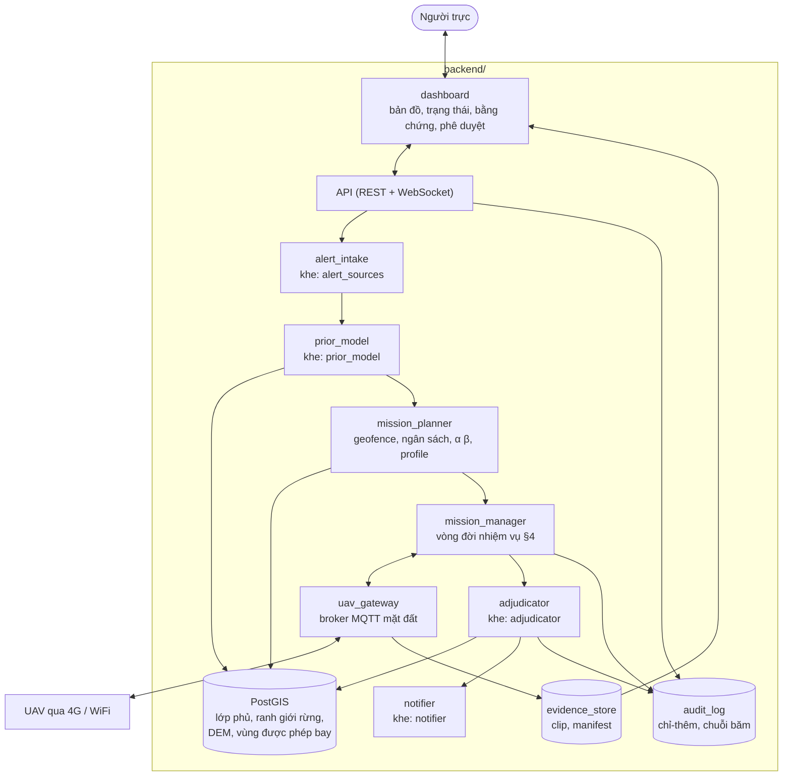
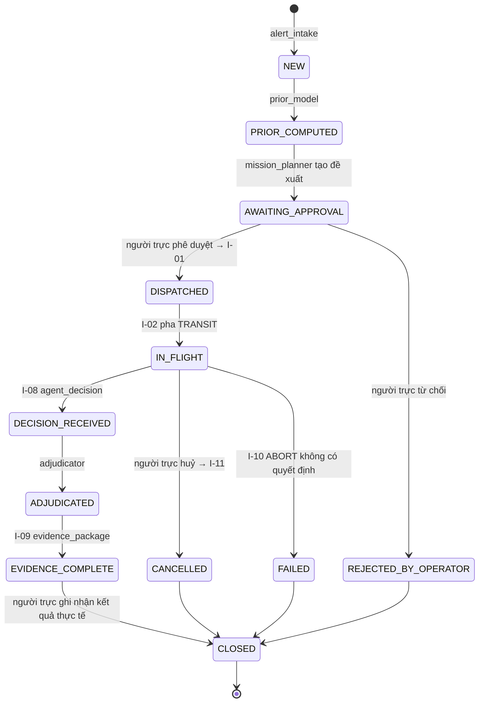

# Module `backend/` — Máy chủ trạm / Chi cục

| | |
|---|---|
| Owner | BE |
| Bài toán thành phần | **P-BE**: tiếp nhận cảnh báo, khởi tạo prior b₀, cho người phê duyệt, giám sát, lưu bằng chứng, **diễn giải kết luận onboard thành kết quả vận hành** |
| Chạy ở đâu | Máy chủ tại trạm kiểm lâm hoặc Chi cục (MVP: một laptop/PC trong mạng của trạm) |
| Yêu cầu PRD | FR-BE-01 … FR-BE-12 |

> Backend là nơi **con người** ra quyết định. Backend **không** điều khiển bay và **không** chạy mô hình thị giác trong vòng quyết định. Mọi kết luận onboard đến đây được **diễn giải** cùng GIS rồi trình người trực.

---

## 1. Phạm vi

**Làm:**
- Nhập cảnh báo (MVP: thủ công trên bản đồ).
- Tính prior b₀ từ GIS.
- Tạo nhiệm vụ: geofence, ngân sách, mục tiêu rủi ro α/β, profile.
- Luồng phê duyệt bay của người trực. Phát `mission_request`; huỷ bằng `mission_control`.
- Dashboard trực tiếp: vị trí UAV, pha nhiệm vụ, quỹ đạo niềm tin, vết quyết định.
- Nhận và lưu `evidence_package` (chỉ-thêm).
- `adjudicator`: diễn giải kết luận onboard → **kết quả vận hành** + mức khẩn.
- Thông báo (MVP: dashboard + webhook/email; V1: SMS/Zalo).
- Broker MQTT phía mặt đất. Nhật ký kiểm toán chỉ-thêm.

**Không làm:**
- Không gửi lệnh bay chi tiết hay góc nhìn (chỉ gửi nhiệm vụ và lệnh huỷ).
- Không sửa kết luận của agent. Không sửa hay xoá bằng chứng.
- Không tự động điều động lực lượng. Người trực quyết định.

---

## 2. Hợp đồng vào/ra

| Hướng | Mã | Thông điệp |
|---|---|---|
| Ra | I-01 | `mission_request` |
| Ra | I-11 | `mission_control` |
| Vào | I-02 | `mission_status` |
| Vào | I-03 | `vehicle_state` (bản thưa) |
| Vào | I-07 | `observation` (lưu, hiển thị) |
| Vào | I-08 | `agent_decision` |
| Vào | I-09 | `evidence_package` |
| Vào | I-10 | `safety_event` |
| Vào | I-12 | `agent_step` |

---

## 3. Kiến trúc nội bộ



---

## 4. Vòng đời cảnh báo và nhiệm vụ



- Kết quả thực tế do người trực ghi khi đóng ("cháy thật / đốt nương / sương / không rõ") là **nhãn vàng** cho mọi KPI và cho hiệu chỉnh prior sau này. Bắt buộc nhập khi đóng.
- Phán xét có thể chạy **trước** khi bằng chứng đầy đủ (ngay khi có `agent_decision`) để người trực xem sớm.

---

## 5. Prior b₀ — không hardcode

| Cài đặt (`prior_model`) | Cách tính | Trạng thái |
|---|---|---|
| `constant` | Một giá trị trong config | Dự phòng / test |
| **`landcover_table`** | Bảng (lớp phủ đất tại mục tiêu × mùa × nguồn cảnh báo) → b₀, nằm trong config, giá trị ban đầu do **chuyên gia kiểm lâm** đề xuất, gắn nhãn `elicited` | **Mặc định MVP** |
| `logistic_historical` | Hồi quy trên nhật ký nhiệm vụ đã đóng (nhãn vàng §4) + đặc trưng GIS, mùa, giờ, nguồn | V1, khi có ≥ vài trăm nhiệm vụ |

- b₀ luôn được kẹp trong [`b0_min`, `b0_max`] (config) để không bao giờ bằng 0 hay 1.
- `mission_request.prior` gồm `b0`, tên mô hình, phiên bản và **câu giải thích**, ví dụ "đất rừng tự nhiên, mùa khô, nguồn chòi canh → 0,35 (bảng chuyên gia v0.1)".

**Lớp GIS** (PostGIS): lớp phủ Việt Nam (LULC 2020, OD Mekong), ranh giới quản lý rừng (xin từ Chi cục), DEM, **vùng được phép bay** của trạm.

---

## 6. `adjudicator` — kết luận onboard → kết quả vận hành

Đầu vào: `agent_decision`, lớp phủ GIS tại mục tiêu, khoảng cách tới bìa rừng, (V1) `observation.landcover_at_base`, (V1) gió/độ ẩm. Đầu ra: **kết quả vận hành** + mức khẩn + giải trình.

| Kết luận onboard | Điều kiện GIS | Kết quả vận hành | Hành động gợi ý trên dashboard |
|---|---|---|---|
| `SMOKE_CONFIRMED` | Mục tiêu trên đất rừng | `FOREST_FIRE_URGENT` | Báo động, gửi toạ độ + clip, đề xuất điều động (người quyết) |
| `SMOKE_CONFIRMED` | Mục tiêu trên đất canh tác / nương rẫy / cỏ | `SMOKE_ON_CULTIVATED_LAND_REVIEW` | **Không phải "vô hại"**: xếp mức khẩn theo khoảng cách tới bìa rừng (V1 thêm gió); cán bộ trực xác nhận |
| `NO_SMOKE` | — | `FALSE_ALARM_NO_SMOKE` | Người trực xác nhận đóng |
| `UNDETERMINED` | — | `UNDETERMINED_HUMAN_REVIEW` | Hiển thị toàn bộ clip + vết quyết định |

> Khoảng 65% vụ cháy rừng ở Việt Nam bắt nguồn từ đốt nương rẫy / đốt đồng cỏ cháy lan (số liệu Bộ NN&PTNT, báo chí dẫn lại; cần số liệu gốc). Vì vậy khói trên đất canh tác được **xếp hạng rủi ro cháy lan**, không bị bỏ qua.

| Cài đặt (`adjudicator`) | Mô tả | Trạng thái |
|---|---|---|
| **`rules_yaml`** | Bảng luật trong config ([`backend/configs/backend.default.yaml`](../../backend/configs/backend.default.yaml)), mỗi luật có ID để truy vết | **Mặc định MVP** |
| `scoring_model` | Mô hình điểm rủi ro học từ nhãn vàng | V1 |
| `llm_report_assist` | LLM/VLM **chỉ tóm tắt** bằng chứng thành báo cáo tiếng Việt; không quyết định | V1, tuỳ chọn |

**Mâu thuẫn GIS ↔ lớp phủ onboard (V1):** chỉ tạo **cờ cần xem** trên dashboard, **không** đổi kết luận của agent. Bản v2 cho mâu thuẫn này ép kết quả "không kết luận được"; bản v3 bỏ, vì nó tạo hai cơ chế abstain chồng nhau ([ADR-002](90-decisions.md)).

---

## 7. Danh mục lựa chọn công nghệ

| Khe | Ứng viên | Mặc định MVP |
|---|---|---|
| API | **FastAPI** | FastAPI + WebSocket cho dữ liệu trực tiếp |
| CSDL | **PostgreSQL + PostGIS** · SQLite + SpatiaLite (dev) | PostGIS |
| Broker | **Mosquitto** · EMQX | Mosquitto |
| Lưu bằng chứng | **Hệ thống file cục bộ** · MinIO (S3) | File cục bộ có checksum |
| Bản đồ | **Leaflet** · MapLibre | Leaflet |
| `alert_sources` | **`manual`** · `tower_camera_api` · `firms_viirs` · `citizen_hotline` | `manual` |
| `notifier` | **`dashboard`** · **`webhook`** · `email` · `sms` · `zalo_oa` | dashboard + webhook |
| Xác thực | Tài khoản cục bộ + JWT · Keycloak | JWT |

---

## 8. Kiểm thử và tiêu chí hoàn thành MVP

| Loại | Tiêu chí |
|---|---|
| Hợp đồng | Mọi thông điệp phát ra validate theo schema; mọi thông điệp nhận về được validate trước khi lưu (sai schema → từ chối + log) |
| Luồng | Từ cảnh báo → phê duyệt → `mission_request` → hiển thị trực tiếp → kết quả vận hành → đóng với nhãn vàng |
| Chỉ-thêm | Không có API sửa/xoá bằng chứng; chuỗi băm của `audit_log` kiểm tra được |
| Phân xử | Mỗi luật trong `rules_yaml` có test; mỗi kết quả vận hành ghi ID luật đã khớp |
| Stub | `fake_uav` phát `mission_status`/`agent_step`/`agent_decision`/`evidence_package` theo kịch bản để BE phát triển độc lập |

---

## 9. Rủi ro và câu hỏi mở

| Rủi ro | Giảm thiểu |
|---|---|
| Chưa có lớp GIS ranh giới rừng chính xác | MVP dùng LULC 2020; xin dữ liệu Chi cục (PRD Q-1) |
| Bảng prior chuyên gia lệch thực tế | Gắn nhãn `elicited`; V1 hiệu chỉnh bằng nhãn vàng |
| Liên kết 4G yếu ở trạm | Lưu-rồi-gửi phía UAV; dashboard hiển thị "dữ liệu trễ" |
| Hình ảnh có người dân | Phân quyền xem, chính sách lưu trữ (NFR-08) |

---

## 10. Cấu trúc thư mục gợi ý

```
backend/
├── README.md
├── configs/        # backend.default.yaml: prior_model, adjudicator rules, notifier, risk targets mặc định
├── src/uav_backend/  # api/, alerts/, prior/, missions/, gateway/, adjudicator/, evidence/, audit/, notify/, ui/
└── tests/          # contract, luồng nhiệm vụ, luật phân xử, chỉ-thêm, stub fake_uav
```
