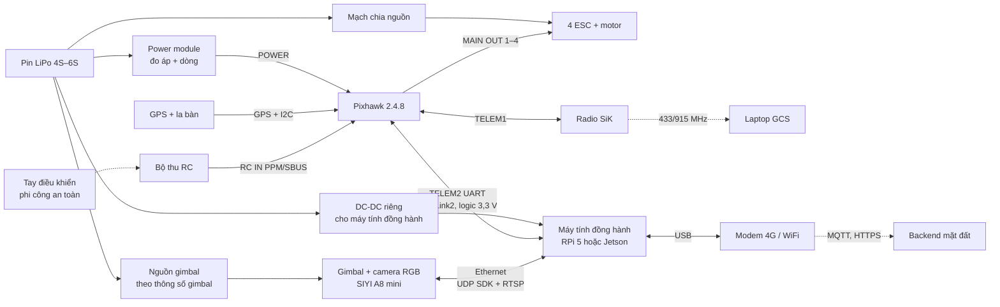

# Phần cứng — ràng buộc, cấu hình MVP, lộ trình nâng cấp

| | |
|---|---|
| Owner | EMB (đấu nối, tích hợp) + Trưởng nhóm (mua sắm) |
| Trạng thái | v3.0 — 02/10/2026 |
| Quyết định liên quan | [ADR-001](90-decisions.md) firmware · [ADR-005](90-decisions.md) vị trí CV · [ADR-006](90-decisions.md) chỉ RGB |

> Giá bên dưới là **giá tham khảo thị trường quốc tế 2025–2026**, cần báo giá lại tại Việt Nam. Khối lượng ghi "ước tính" phải **cân thực tế** trước khi chốt khung bay.

---

## 1. Ràng buộc đã chốt

| Ràng buộc | Nội dung | Hệ quả kiến trúc |
|---|---|---|
| Ngân sách phần cứng hạn chế | Ưu tiên tái dùng thiết bị sẵn có, mua theo từng mốc | Kiến trúc chạy được trên RPi 5 (biến thể A); CV có thể chạy ở mặt đất |
| Bộ điều khiển bay | **Pixhawk 2.4.8** (đã có) | ArduPilot `Pixhawk1-1M`, MAVLink qua UART ([ADR-001](90-decisions.md)) |
| Cảm biến | **Chỉ camera RGB, không camera nhiệt** | Chỉ hoạt động ban ngày; nhóm báo giả 1 giải bằng đặc trưng chuyển động + ngữ cảnh ([ADR-006](90-decisions.md)) |
| Mục tiêu | **MVP sản phẩm trước**, paper sau | Bay VLOS, phi công an toàn, không trạm sạc tự động ở MVP |

---

## 2. Pixhawk 2.4.8 — sự thật kỹ thuật cần biết

| Hạng mục | Thực tế | Nguồn |
|---|---|---|
| Vi điều khiển | STM32F427 168 MHz, 192 KB RAM, **1 MB flash** (bản clone FMUv2; nhiều bo dính lỗi silicon giới hạn 1 MB) | [ArduPilot – Pixhawk overview](https://ardupilot.org/copter/docs/common-pixhawk-overview.html) |
| ArduPilot | Target **`Pixhawk1-1M`**, một số tính năng bị lược bỏ | [Danh sách giới hạn theo bo](https://ardupilot.org/copter/docs/binary-features.html) |
| PX4 | `px4_fmu-v2` phát hành lần cuối ở **v1.15**; **không** chạy uXRCE-DDS (cầu ROS 2) trên bo 1 MB | [PX4 – Pixhawk 1](https://docs.px4.io/v1.16/en/flight_controller/pixhawk), [uXRCE-DDS](https://docs.px4.io/main/en/middleware/uxrce_dds) |
| Cổng dùng trong dự án | TELEM1 (radio GCS), **TELEM2 (máy tính đồng hành)**, GPS, I2C (la bàn), RC IN, POWER, MAIN OUT 1–4 | — |
| Chất lượng | Bản clone thường kém về chống rung IMU, ổn áp, barometer | Kinh nghiệm cộng đồng |

**Kết luận:** dùng tốt cho SITL/HITL và bay thử VLOS. **Không** khuyến nghị cho bay ngoài tầm nhìn (BVLOS) trên rừng. Nâng cấp theo §6 trước V1.

---

## 3. Danh mục phần cứng MVP (BOM)

| # | Hạng mục | Lựa chọn | Trạng thái | Giá tham khảo | Ghi chú |
|---|---|---|---|---|---|
| 1 | Bộ điều khiển bay | Pixhawk 2.4.8 | **Đã có** | — | ArduPilot Copter `Pixhawk1-1M` |
| 2 | GPS + la bàn | M8N (thường kèm bộ 2.4.8) / M10 | Đã có / đề xuất | 20–40 USD | M10 cho fix nhanh hơn |
| 3 | Power module | Loại đi kèm Pixhawk (đo áp + dòng) | Bắt buộc | ~10–20 USD | Cần cho failsafe pin |
| 4 | Radio telemetry | SiK 433/915 MHz | Bắt buộc | 30–60 USD | **Kiểm tra băng tần được phép tại Việt Nam** |
| 5 | Tay điều khiển + bộ thu RC | Bất kỳ, hỗ trợ PPM/SBUS | **Bắt buộc** (phi công an toàn) | — | RC override luôn thắng |
| 6 | Khung, motor, ESC, cánh, pin | Quad 450–650 mm, pin 4S–6S | Bắt buộc | 200–500 USD | Thời gian bay ≥ 20 phút với tải 0,4–0,6 kg |
| 7 | **Máy tính đồng hành** | Xem §4 | **Cần chốt** | 80–250 USD | Agent bắt buộc chạy trên này |
| 8 | Gimbal + camera RGB | **SIYI A8 mini** (3 trục, 4K, 95 g, Ethernet UDP SDK + RTSP) | Khuyến nghị | 260–330 USD | [SIYI](https://shop.siyi.biz/collections/gimbal-camera). Phương án rẻ: gimbal 2 trục + camera USB/CSI (ổn định kém hơn, bù bằng ổn định ảnh) |
| 9 | Liên kết tới backend | Modem/USB 4G LTE trên máy tính đồng hành; hoặc WiFi tầm ngắn khi thử VLOS | Đề xuất | 30–60 USD | Vùng núi phủ sóng kém, cần lưu-rồi-gửi (NFR-06) |
| 10 | Nguồn cho máy tính đồng hành | DC-DC riêng từ pin chính (RPi 5: 5 V/5 A) | **Bắt buộc** | 10–25 USD | **Không** lấy nguồn từ cổng Pixhawk |
| 11 | Laptop mặt đất | Chạy GCS (Mission Planner/QGC), backend MVP | Đã có (giả định) | — | — |
| 12 | Máy huấn luyện | GPU bất kỳ / Colab / Kaggle | Đã có (giả định) | — | Không cần trên UAV |

---

## 4. Máy tính đồng hành — so sánh và khuyến nghị

| Tiêu chí | **A. Raspberry Pi 5 (8 GB)** | **A+. RPi 5 + AI HAT+ (Hailo-8L/8)** | **B. Jetson Orin Nano Super (8 GB)** |
|---|---|---|---|
| Giá tham khảo | ~80–100 USD | + ~70 / ~110 USD | 249 USD ([NVIDIA](https://developer.nvidia.com/blog/nvidia-jetson-orin-nano-developer-kit-gets-a-super-boost/)) |
| Năng lực AI | CPU; YOLO11n NCNN ~70–80 ms/khung 640 ([Ultralytics](https://docs.ultralytics.com/guides/raspberry-pi)) | 13 / 26 TOPS INT8 cho detector | 67 TOPS INT8; YOLO26n TensorRT FP16 ~4,6 ms ([Ultralytics](https://docs.ultralytics.com/guides/nvidia-jetson)) |
| Dòng quang học, mô hình video | DIS flow trên CPU: được; mô hình video học sâu: chậm | NPU kém hỗ trợ flow/video; flow vẫn chạy CPU | Tốt (CUDA) |
| Công suất | ~5–12 W | + ~2–3 W | 7–25 W |
| Khối lượng (ước tính) | ~50–80 g kèm tản nhiệt | + ~30 g | ~100–250 g tuỳ carrier/tản nhiệt |
| Phù hợp MVP | **Đủ** cho agent + embedded + CV MVP (gbdt trên đặc trưng flow + detector n, k ≈ 8–16 khung/clip ≈ vài giây) | Khi detector lớn hơn | **Khuyến nghị** khi cần mô hình video / phân đoạn lớp phủ (V1) |

**Khuyến nghị theo ngân sách:**
1. **Ngân sách thấp nhất:** RPi 5. Toàn bộ agent + embedded chạy onboard; CV MVP chạy onboard ở chế độ nhẹ, hoặc ở laptop mặt đất (`clip_ready.uri = https://…`).
2. **Khi có thêm 250 USD:** Jetson Orin Nano Super. CV đầy đủ onboard, không phụ thuộc liên kết.

Kiến trúc **không đổi code** giữa hai lựa chọn ([00-overview §9](00-overview.md)). **Không mua Jetson trước khi pipeline CV chạy được trên PC** (tránh mua sớm).

---

## 5. Sơ đồ đấu nối (MVP)

- **GND chung** giữa Pixhawk TELEM2 và máy tính đồng hành; mức logic 3,3 V. An toàn hơn: adapter USB–UART.
- Camera SIYI dùng mạng `192.168.144.x` mặc định (SDK UDP cổng 37260, RTSP). Máy tính đồng hành đặt IP tĩnh cùng dải ([A8 mini manual](https://siyi.biz/siyi_file/A8%20mini/A8%20mini%20User%20Manual%20v1.6.pdf)).
- Gimbal điều khiển **trực tiếp từ máy tính đồng hành**, không qua FC. Lý do: tránh phụ thuộc driver mount có thể bị lược trên bản firmware 1 MB.

---

## 6. Ngân sách thời gian cho KPI phản ứng [ước tính]

| Tốc độ hành trình | Bay 5 km | Cất cánh + lên độ cao | 3 lần quan sát (dịch chuyển ~20–30 s + settle + hover 2 s) | Tổng tới khi kết luận |
|---|---|---|---|---|
| 10 m/s | 8,3 phút | ~1 phút | ~1,5 phút | **~10,8 phút** |
| 15 m/s | 5,6 phút | ~1 phút | ~1,5 phút | **~8,1 phút** |

- KPI "dưới 10 phút trong bán kính 5 km" (PRD) đòi **hành trình ≥ 12–15 m/s**. Đây là KPI của **V1/V2**. MVP bay VLOS với bán kính nhỏ (PRD §8).
- Thời gian bay giữa các góc nhìn **lớn hơn nhiều** thời gian suy luận, nên chi phí của agent mô hình hoá theo thời gian bay (`cost_model: flight_time`).
- Công suất máy tính đồng hành (5–25 W) chỉ là vài phần trăm công suất hover của một quad 2–3 kg [ước tính]. Ràng buộc chính là **khối lượng và tản nhiệt** (mùa khô 35–40 °C), không phải điện năng.

---

## 7. Lộ trình nâng cấp (sau MVP)

| Hạng mục | Từ | Lên | Khi nào | Ảnh hưởng code |
|---|---|---|---|---|
| FC | Pixhawk 2.4.8 | Bo **STM32H743**: [Pixhawk 6C Mini](https://holybro.com/products/pixhawk-6c-mini) (~130–150 USD) hoặc bo H743 giá rẻ (~40–50 USD, hỗ trợ PX4/ArduPilot) | Trước bay xa / V1 | Chỉ `fc_bridge` + file tham số; ArduPilot ≥ 4.5 có ROS 2 native nếu cần |
| Máy tính đồng hành | RPi 5 | Jetson Orin Nano Super | Khi CV cần GPU | Chỉ config `runtime` của CV |
| Liên kết | 4G USB | Radio tầm xa (video + data) | Khi BVLOS | `link_bridge` |
| Trạm sạc | Không | Tự chế hoặc thương mại | V2 | `mission_executor` thêm pha dock |
| Cảm biến | RGB | (Tuỳ chọn) RGB + nhiệt | Nếu ngân sách cho phép | CV thêm modality; agent không đổi (vẫn nhận LLR) |

**Đường thu dữ liệu giá rẻ, song song MVP:** một drone thương mại nhỏ có SDK, ví dụ DJI Mini 4 Pro + MSDK v5 (Android, hỗ trợ từ 03/2025: waypoint + virtual stick — [MSDK v5](https://github.com/dji-sdk/Mobile-SDK-Android-V5)). Dùng để quay **clip đa góc nhìn** cho tập hiệu chỉnh A-01 trước khi UAV tự chế bay ổn định. Đây là công cụ thu dữ liệu, không phải nền tảng sản phẩm.

---

## 8. Thứ tự lắp đặt và kiểm thử phần cứng (HITL)

1. Nạp ArduPilot `Pixhawk1-1M`. Kiểm tra danh sách tính năng có: GUIDED, fence, battery failsafe, RTL.
2. Hiệu chuẩn cảm biến, la bàn, ESC; kiểm tra rung trên log.
3. Nối TELEM2 ↔ máy tính đồng hành. `fc_bridge` đọc được heartbeat, `GLOBAL_POSITION_INT`, `SYS_STATUS`.
4. Gimbal: điều khiển qua SDK UDP, đọc góc; nhận RTSP; đo trễ khung.
5. HITL tháo cánh: chạy kịch bản L2 ([30-embedded §10](30-embedded.md)), thử mọi failsafe.
6. Bay thử VLOS thủ công → GUIDED điểm đơn → chuỗi `view_command` từ `scripted_agent` → agent thật.
7. Lưu file tham số đã kiểm chứng vào `embedded/firmware/params/`.

---

## 9. Pháp lý và an toàn bay

- Hoạt động UAV theo **Nghị định 288/2025/NĐ-CP** (hiệu lực 05/11/2025). Cần xác định thủ tục cấp phép bay thử VLOS tại địa điểm thử. Liên hệ cơ quan quân sự địa phương (PRD Q-2).
- MVP chỉ bay **trong tầm nhìn**, có **phi công an toàn** cầm tay điều khiển, ban ngày, thời tiết tốt.
- Nguồn khói thử nghiệm: phối hợp kiểm lâm khi **đốt thực bì có phép**, hoặc dùng nguồn khói kiểm soát an toàn. Không tự gây cháy.
